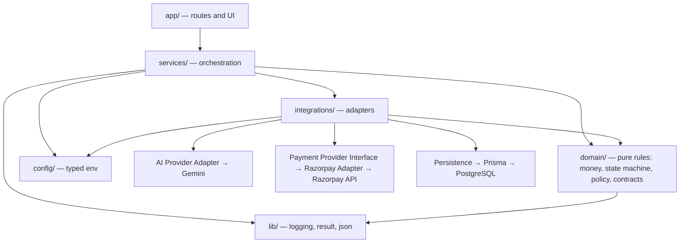

# 02 — Architecture

## A modular monolith, deliberately

This is **one Next.js application, one deployable unit, one database** — with
hard internal module boundaries. It is explicitly **not** a microservice
architecture, and it must not be split into separate services.

The reason is the financial invariant itself. Authorization, the authoritative
amount and the transaction state transition have to happen together, in one
process, against one database, inside one transaction. Distributing them across
services would replace a compiler-checked call with a network hop that can
partially fail — turning "AI cannot bypass the policy engine" from a guarantee
into a hope about retry semantics. A modular monolith gives the same separation
of concerns with none of that risk, and is the right size for this system.

What keeps it modular rather than a big ball of mud: every module below has a
declared contract, an allowed dependency list, and a stated set of things it may
not do. The boundaries are enforced by dependency direction, by the actor-scoped
transition table, and by lint rules — not by process isolation.

## Dependency direction

Dependencies point **inward**. The domain core knows nothing about Next.js,
Razorpay, Gemini, Prisma, or PostgreSQL. That is what allows the financial
rules to be tested exhaustively with no network, no keys and no database.

Rules that keep this acyclic:

- `domain/` imports only from `domain/` and `lib/`. Never from `services/`,
  `integrations/`, `config/` or `app/`. It contains no vendor name.
- `integrations/` imports from `domain/`, `config/` and `lib/`. Never from
  `services/`.
- `services/` may import anything below it, and is the only layer allowed to
  compose an integration with a domain rule.
- `app/` contains no business logic. A route handler parses, delegates to one
  service, and maps the result to a response.

## The module boundaries

Each boundary states its contract. Only the parts marked **implemented** exist
today; the rest is the design later objectives must build to.

---

### 1. Buyer Agent — `src/services/buyer-agent/` _(not implemented)_

|                          |                                                                                                                                                                                                                                |
| ------------------------ | ------------------------------------------------------------------------------------------------------------------------------------------------------------------------------------------------------------------------------ |
| **Responsibility**       | Turn a natural-language request into a validated structured purchase intent, and later turn a candidate list into a proposed selection with a short explanation.                                                               |
| **Trusted inputs**       | The catalog projection handed to it by the Merchant Service. The transaction id it is operating within.                                                                                                                        |
| **Untrusted inputs**     | The user's raw prompt. Every token the model returns. Product titles and descriptions from the catalog, treated as potential prompt injection.                                                                                 |
| **Outputs**              | `PurchaseIntent` (schema-validated) and `ProductProposal` (`productId` plus a short reason). **No amount. No authority.**                                                                                                      |
| **Allowed dependencies** | AI Provider Adapter, catalog read projection, decision-record contract, logger.                                                                                                                                                |
| **Prohibited**           | Computing or asserting a payment amount. Touching the payment provider. Writing transaction state. Reading secrets. Approving anything. Persisting audit events directly. Importing a Gemini type.                             |
| **Persistence**          | None of its own. Its proposals are recorded by the Transaction and Audit services.                                                                                                                                             |
| **Security**             | Model output is parsed by a Zod schema before it is read; a parse failure is a normal, audited rejection. `productId` is an untrusted claim until the Merchant Service resolves it. Catalog text may never alter instructions. |
| **Called by**            | The intent and decision services. Never by a route handler directly.                                                                                                                                                           |

---

### 2. AI Provider Adapter — `src/integrations/llm/` _(not implemented)_

|                          |                                                                                                                                                                                                                                                            |
| ------------------------ | ---------------------------------------------------------------------------------------------------------------------------------------------------------------------------------------------------------------------------------------------------------- |
| **Responsibility**       | The only module that speaks to an external LLM. Sends a prompt envelope, receives a response, and returns a **validated domain object** — never a provider object.                                                                                         |
| **Trusted inputs**       | The prompt envelope built by the caller. Credentials from the config boundary.                                                                                                                                                                             |
| **Untrusted inputs**     | Everything the provider returns.                                                                                                                                                                                                                           |
| **Outputs**              | Validated domain structures only (`PurchaseIntent`, `ProductProposal`), or a typed `ValidationError`.                                                                                                                                                      |
| **Allowed dependencies** | Config, domain contracts, logger.                                                                                                                                                                                                                          |
| **Prohibited**           | Leaking a Gemini response shape, interaction object, or SDK type past its own boundary. Retrying until a malformed response happens to parse. Making a business decision.                                                                                  |
| **Persistence**          | None.                                                                                                                                                                                                                                                      |
| **Security**             | The chain is fixed: `External LLM Provider → AI Provider Adapter → schema validation → validated domain object → application logic`. Nothing skips a link. Prompt text and any hidden reasoning stay inside this boundary and are never logged or audited. |
| **Called by**            | Buyer Agent and Product Decision Engine only.                                                                                                                                                                                                              |
| **Enables**              | Mocking AI in tests (swap the adapter), replacing the provider, and testing all business logic with no model at all.                                                                                                                                       |

---

### 3. Merchant Service — `src/services/merchant/` _(not implemented)_

|                          |                                                                                                                                |
| ------------------------ | ------------------------------------------------------------------------------------------------------------------------------ |
| **Responsibility**       | Own the authoritative product record: price, currency, availability, merchant identity. Answer "what is this product, really?" |
| **Trusted inputs**       | PostgreSQL, via the persistence boundary.                                                                                      |
| **Untrusted inputs**     | Any `productId` arriving from an agent or a browser.                                                                           |
| **Outputs**              | `VerifiedProduct` — the resolved product with server-read `Money` and stock, or a typed verification failure.                  |
| **Allowed dependencies** | Persistence, domain money, logger.                                                                                             |
| **Prohibited**           | Accepting a price from a caller. Accepting an amount as a parameter at all. Any LLM call. Authorization decisions.             |
| **Persistence**          | Products, merchants.                                                                                                           |
| **Security**             | Verification re-reads from the database and ignores every field the caller supplied except the identifier.                     |
| **Called by**            | Transaction Service, during `PRODUCT_SELECTED → PRODUCT_VERIFIED`.                                                             |

---

### 4. Agent-Readable Catalog — `src/services/merchant/catalog.ts` _(not implemented)_

|                          |                                                                                                                                                                   |
| ------------------------ | ----------------------------------------------------------------------------------------------------------------------------------------------------------------- |
| **Responsibility**       | Expose a bounded, machine-friendly projection of the catalog that an agent can search and compare over.                                                           |
| **Trusted inputs**       | The product store.                                                                                                                                                |
| **Untrusted inputs**     | Search parameters from the agent.                                                                                                                                 |
| **Outputs**              | A capped list of candidates with stable ids, normalised attributes and display prices.                                                                            |
| **Allowed dependencies** | Persistence, domain money.                                                                                                                                        |
| **Prohibited**           | Returning unbounded result sets. Returning internal cost, margin or supplier data. Acting as the price source for a payment.                                      |
| **Persistence**          | Read-only over products.                                                                                                                                          |
| **Security**             | Result count and text length are capped, so a hostile listing cannot flood the model's context. Descriptions are marked as untrusted data in the prompt envelope. |
| **Called by**            | Buyer Agent, and the catalog route.                                                                                                                               |

---

### 5. Product Decision Engine — `src/services/product-decision/` _(not implemented)_

|                          |                                                                                                                                                                                   |
| ------------------------ | --------------------------------------------------------------------------------------------------------------------------------------------------------------------------------- |
| **Responsibility**       | Reduce a candidate set to one selection under the user's stated constraints, and emit a `DecisionRecord` explaining the choice.                                                   |
| **Trusted inputs**       | Candidate list from the catalog. Structured constraints from the validated intent.                                                                                                |
| **Untrusted inputs**     | The model's ranking rationale.                                                                                                                                                    |
| **Outputs**              | `ProductSelection` (`productId`, rank, reason) plus a decision record.                                                                                                            |
| **Allowed dependencies** | Buyer Agent, AI Provider Adapter, catalog projection, decision-record contract.                                                                                                   |
| **Prohibited**           | Treating its own selection as authorised. Bypassing verification. Producing an amount.                                                                                            |
| **Persistence**          | Decision records, via the Audit Service.                                                                                                                                          |
| **Security**             | Hard filters (budget, availability) are applied **deterministically** both before and after the model ranks. The model orders what survives; it does not decide what is eligible. |
| **Called by**            | Transaction Service.                                                                                                                                                              |

---

### 6. PurchaseQuote — `src/services/quote/` _(not implemented; architecture only)_

|                          |                                                                                                                                                                                                                                                                                                                              |
| ------------------------ | ---------------------------------------------------------------------------------------------------------------------------------------------------------------------------------------------------------------------------------------------------------------------------------------------------------------------------- |
| **Responsibility**       | Freeze the verified purchase facts into a single immutable, time-limited record. **The bridge between AI product selection and deterministic policy evaluation.**                                                                                                                                                            |
| **Trusted inputs**       | `VerifiedProduct` re-read from PostgreSQL.                                                                                                                                                                                                                                                                                   |
| **Untrusted inputs**     | Nothing. It accepts no amount, no price and no currency from any caller.                                                                                                                                                                                                                                                     |
| **Outputs**              | A `PurchaseQuote` holding: transaction id, product id, quantity, **amount in integer minor units**, currency, creation time, expiry time, and optionally a product version reference.                                                                                                                                        |
| **Allowed dependencies** | Persistence, domain money.                                                                                                                                                                                                                                                                                                   |
| **Prohibited**           | Being created from an agent proposal directly, without verification in between. Being mutated after creation. Outliving its expiry.                                                                                                                                                                                          |
| **Persistence**          | `PurchaseQuote` (Objective 2 models it).                                                                                                                                                                                                                                                                                     |
| **Security**             | Everything downstream — policy, approval, authorization, the payment order — reads the amount from the quote and from nowhere else. That is what makes "the amount cannot come from the browser or the LLM" a single checkable fact rather than a rule repeated at six call sites. Expiry stops a stale price being charged. |
| **Called by**            | Transaction Service, during `PRODUCT_VERIFIED → QUOTE_CREATED`.                                                                                                                                                                                                                                                              |
| **Objectives**           | Objective 2 models it; Objective 6 implements behaviour.                                                                                                                                                                                                                                                                     |

---

### 7. Policy / Authorization Engine — `src/domain/policy/` _(not implemented; contracts in place)_

|                          |                                                                                                                                                               |
| ------------------------ | ------------------------------------------------------------------------------------------------------------------------------------------------------------- |
| **Responsibility**       | Decide, deterministically, whether a **quoted** amount may be paid: budget ceiling, per-transaction cap, category rules, approval threshold, velocity limits. |
| **Trusted inputs**       | The `PurchaseQuote`. The stored `AuthorizationPolicy`.                                                                                                        |
| **Untrusted inputs**     | Nothing. It refuses caller-supplied amounts and caller-supplied policies.                                                                                     |
| **Outputs**              | `PolicyDecision` = `allowed` \| `requires_approval` \| `blocked`, plus the rule id and a `DecisionRecord`.                                                    |
| **Allowed dependencies** | Domain money, decision-record contract. Pure, apart from a policy read.                                                                                       |
| **Prohibited**           | Any LLM call. Any network call. Any payment call. Being reachable from the agent's tool surface.                                                              |
| **Persistence**          | Reads policies; writes only decisions.                                                                                                                        |
| **Security**             | This is the gate. It must be pure and total: every input maps to one of the three outcomes, and anything unrecognised defaults to `blocked`.                  |
| **Called by**            | Transaction Service only.                                                                                                                                     |

---

### 8. Human Approval Gate — `src/services/approval/` _(not implemented)_

|                          |                                                                                                                                                                                                            |
| ------------------------ | ---------------------------------------------------------------------------------------------------------------------------------------------------------------------------------------------------------- |
| **Responsibility**       | Hold a transaction that policy marked `requires_approval` until a human explicitly approves or denies a specific quoted amount, and expire it otherwise.                                                   |
| **Trusted inputs**       | An authenticated human action.                                                                                                                                                                             |
| **Untrusted inputs**     | The approval request payload from the browser.                                                                                                                                                             |
| **Outputs**              | `approval_granted` or `approval_denied`, bound to one transaction, one quote and one approver.                                                                                                             |
| **Allowed dependencies** | Persistence, transaction service, audit.                                                                                                                                                                   |
| **Prohibited**           | Auto-approval of any kind. Approval by a non-human actor. Approving an amount different from the quoted one.                                                                                               |
| **Persistence**          | `ApprovalRequest`, with an expiry.                                                                                                                                                                         |
| **Security**             | The transition table grants `APPROVAL_REQUIRED → AUTHORIZED` to `approval_gate` alone, so no agent path can reach it. The acknowledged amount is re-compared to the quote before the authorization stands. |
| **Called by**            | Approval routes.                                                                                                                                                                                           |

---

### 9. Inventory Reservation — `src/services/inventory/` _(not implemented; architecture only)_

|                          |                                                                                                                                                                                                                                                                                                                                                                                                                                                                                                                          |
| ------------------------ | ------------------------------------------------------------------------------------------------------------------------------------------------------------------------------------------------------------------------------------------------------------------------------------------------------------------------------------------------------------------------------------------------------------------------------------------------------------------------------------------------------------------------ |
| **Responsibility**       | Hold stock for an authorized transaction **before** money moves, then commit it on completion or release it on failure.                                                                                                                                                                                                                                                                                                                                                                                                  |
| **Trusted inputs**       | An existing authorization and its quote.                                                                                                                                                                                                                                                                                                                                                                                                                                                                                 |
| **Untrusted inputs**     | Nothing.                                                                                                                                                                                                                                                                                                                                                                                                                                                                                                                 |
| **Outputs**              | An `InventoryReservation` with an expiry, or a typed "unavailable" failure.                                                                                                                                                                                                                                                                                                                                                                                                                                              |
| **Allowed dependencies** | Persistence, domain money, logger.                                                                                                                                                                                                                                                                                                                                                                                                                                                                                       |
| **Prohibited**           | Being skipped on the way to a payment. Being created or released by an AI actor. Reserving more than is available.                                                                                                                                                                                                                                                                                                                                                                                                       |
| **Persistence**          | `InventoryReservation` (Objective 2 models it).                                                                                                                                                                                                                                                                                                                                                                                                                                                                          |
| **Security**             | This exists to close the **check-then-charge race**: verifying stock and then charging leaves a window in which another buyer takes the last unit, and the customer is charged for something that cannot ship. The fixed order is `verify → authorize → reserve → pay → commit or release`. The transition table enforces it by giving `AUTHORIZED` no edge to `PAYMENT_ORDER_CREATED` — the only way forward is through `INVENTORY_RESERVED`. `holdsInventory(state)` names every state in which a hold is outstanding. |
| **Called by**            | Transaction Service.                                                                                                                                                                                                                                                                                                                                                                                                                                                                                                     |
| **Objectives**           | Objective 2 models persistence; Objective 8 implements behaviour.                                                                                                                                                                                                                                                                                                                                                                                                                                                        |

---

### 10. Transaction Service — `src/services/transaction/` _(transition service implemented in Objective 3)_

|                          |                                                                                                                                                                 |
| ------------------------ | --------------------------------------------------------------------------------------------------------------------------------------------------------------- |
| **Responsibility**       | Own the transaction record and its state. Orchestrate the flow. It is the only writer of transaction state.                                                     |
| **Trusted inputs**       | Its own database rows. Results returned by the modules it calls.                                                                                                |
| **Untrusted inputs**     | Every request to change state, regardless of origin.                                                                                                            |
| **Outputs**              | Persisted transactions, state transitions and transition history; audit events for each.                                                                        |
| **Allowed dependencies** | Everything below it: domain state machine, merchant, quote, policy, approval, inventory, payment provider interface, audit.                                     |
| **Prohibited**           | Interpreting natural language. Ranking products. Making authorization decisions itself — it _asks_ the policy engine. Naming a payment vendor.                  |
| **Persistence**          | `Transaction`, plus `TransactionStateTransition`.                                                                                                               |
| **Security**             | Every write goes through `evaluateTransition`, which checks both the edge and the actor. Idempotency keys are stored so a replayed request cannot double-write. |
| **Called by**            | Route handlers, the webhook handler, the approval gate.                                                                                                         |

---

### 11. Transaction State Machine — `src/domain/transaction/` _(implemented; event-driven since Objective 3)_

|                          |                                                                                                                                                                                                                                              |
| ------------------------ | -------------------------------------------------------------------------------------------------------------------------------------------------------------------------------------------------------------------------------------------- |
| **Responsibility**       | Define the legal lifecycle and adjudicate every requested transition against both the edge and the requesting actor.                                                                                                                         |
| **Trusted inputs**       | None — it trusts nothing and is pure.                                                                                                                                                                                                        |
| **Untrusted inputs**     | `TransitionRequest`.                                                                                                                                                                                                                         |
| **Outputs**              | `Result<TransitionApproval, TransitionRejection>`.                                                                                                                                                                                           |
| **Allowed dependencies** | `domain/errors`, `domain/identifiers`, `lib/result`. Nothing else.                                                                                                                                                                           |
| **Prohibited**           | I/O of any kind. Persistence. Knowing what Razorpay, Gemini, Prisma or PostgreSQL are.                                                                                                                                                       |
| **Persistence**          | None.                                                                                                                                                                                                                                        |
| **Security**             | The single authoritative definition of transaction states. No competing enum may exist anywhere, including in the eventual Prisma schema, which must be generated from or matched to this list. See [05](./05-transaction-state-machine.md). |
| **Called by**            | Transaction Service.                                                                                                                                                                                                                         |

---

### 12. Transaction State Transition History — _(not implemented; architecture only)_

|                          |                                                                                                                                                                                                                                                                                              |
| ------------------------ | -------------------------------------------------------------------------------------------------------------------------------------------------------------------------------------------------------------------------------------------------------------------------------------------- |
| **Responsibility**       | Persist not just `Transaction.currentState` but **every** transition: previous state, next state, actor, reason, timestamp.                                                                                                                                                                  |
| **Trusted inputs**       | An approved `TransitionApproval` from the state machine.                                                                                                                                                                                                                                     |
| **Untrusted inputs**     | None.                                                                                                                                                                                                                                                                                        |
| **Outputs**              | An append-only `TransactionStateTransition` row per accepted transition.                                                                                                                                                                                                                     |
| **Allowed dependencies** | Persistence.                                                                                                                                                                                                                                                                                 |
| **Prohibited**           | Updates. Deletes. Being written for a _rejected_ transition (those are audit events, not history).                                                                                                                                                                                           |
| **Persistence**          | `TransactionStateTransition` (Objective 2 models it).                                                                                                                                                                                                                                        |
| **Security**             | A current-state-only model cannot answer "how did this transaction get here", which is exactly the question a payment dispute, a reconciliation job, a debugging session and a judge all ask. Storing the path makes the lifecycle replayable and makes a silent out-of-order write visible. |
| **Called by**            | Transaction Service, on every accepted transition.                                                                                                                                                                                                                                           |
| **Objectives**           | Objective 2 models it; Objective 3 implements behaviour.                                                                                                                                                                                                                                     |

---

### 13. Payment Provider Interface — `src/integrations/payment/` _(not implemented)_

|                          |                                                                                                                                                                                                                                                                                                                                                               |
| ------------------------ | ------------------------------------------------------------------------------------------------------------------------------------------------------------------------------------------------------------------------------------------------------------------------------------------------------------------------------------------------------------- |
| **Responsibility**       | The **vendor-neutral** contract the Transaction Service depends on: create a payment order, verify a payment, verify a webhook signature.                                                                                                                                                                                                                     |
| **Trusted inputs**       | The authorized amount, taken from the `PurchaseQuote`.                                                                                                                                                                                                                                                                                                        |
| **Untrusted inputs**     | Everything a provider returns.                                                                                                                                                                                                                                                                                                                                |
| **Outputs**              | Domain shapes only: `PaymentOrder`, `PaymentOutcome`, `WebhookVerification`.                                                                                                                                                                                                                                                                                  |
| **Allowed dependencies** | Config, domain money, logger.                                                                                                                                                                                                                                                                                                                                 |
| **Prohibited**           | Exposing any provider type, provider error, or provider id format in its signatures.                                                                                                                                                                                                                                                                          |
| **Security**             | The chain is `Application Transaction Service → Payment Provider Interface → Razorpay Adapter → Razorpay API`. The domain depends on the middle link only. The domain core does not contain the string "razorpay" — a test asserts this for the state machine's actor vocabulary, which is why the actors are named `payment_provider` and `payment_webhook`. |
| **Called by**            | Transaction Service.                                                                                                                                                                                                                                                                                                                                          |

---

### 14. Razorpay Adapter — `src/integrations/payment/razorpay/` _(not implemented)_

|                          |                                                                                                                                                                                                                                                                               |
| ------------------------ | ----------------------------------------------------------------------------------------------------------------------------------------------------------------------------------------------------------------------------------------------------------------------------- |
| **Responsibility**       | The single implementation of the Payment Provider Interface. The only code that imports a Razorpay SDK or calls a Razorpay URL.                                                                                                                                               |
| **Trusted inputs**       | Razorpay credentials from the config boundary.                                                                                                                                                                                                                                |
| **Untrusted inputs**     | Every Razorpay response body and every webhook payload, until parsed and verified.                                                                                                                                                                                            |
| **Outputs**              | Domain shapes, per the interface above.                                                                                                                                                                                                                                       |
| **Allowed dependencies** | Config, domain money, logger.                                                                                                                                                                                                                                                 |
| **Prohibited**           | Deciding whether a payment is allowed. Computing an amount. Being called by the agent, by a route handler, or by the domain. Letting the key secret cross its own boundary.                                                                                                   |
| **Persistence**          | None directly; `PaymentAttempt` rows are written by the Transaction Service.                                                                                                                                                                                                  |
| **Security**             | Amounts are passed in minor units exactly as quoted, so no conversion step exists where a rounding bug could live. Razorpay-specific concerns — order parameters, provider ids, provider error codes, capture semantics, signature format — stay entirely inside this folder. |
| **To verify**            | Order-creation parameters, capture semantics (automatic vs manual) and the signature payload format are _to be verified during the Razorpay integration objective_ against current Razorpay documentation, not assumed here.                                                  |

---

### 15. Webhook Handler — `src/app/api/webhooks/razorpay/` and `src/services/webhook/` _(not implemented)_

|                          |                                                                                                                                                                                                    |
| ------------------------ | -------------------------------------------------------------------------------------------------------------------------------------------------------------------------------------------------- |
| **Responsibility**       | Accept inbound provider events, verify them, deduplicate them, and translate verified events into transaction transitions.                                                                         |
| **Trusted inputs**       | Nothing on arrival.                                                                                                                                                                                |
| **Untrusted inputs**     | The entire request: body, headers, signature, timing, ordering.                                                                                                                                    |
| **Outputs**              | A stored `WebhookEvent` and, when the event is new and valid, one transition request as actor `payment_webhook`.                                                                                   |
| **Allowed dependencies** | Config, persistence, payment provider interface (for verification), transaction service, audit.                                                                                                    |
| **Prohibited**           | Trusting the payload before signature verification. Reprocessing a `providerEventId` already seen. Assuming events arrive in order or exactly once.                                                |
| **Persistence**          | `WebhookEvent`, keyed uniquely on the provider event id.                                                                                                                                           |
| **Security**             | The order of operations is fixed: read the raw body, verify the HMAC against the raw bytes, parse, deduplicate, then act. Duplicates still return a success status so the provider stops retrying. |
| **Called by**            | The payment provider, over the public internet.                                                                                                                                                    |
| **To verify**            | Header name, signature algorithm and the exact retry and ordering guarantees are _to be verified during the Razorpay integration objective_.                                                       |

---

### 16. Persistence — `src/integrations/persistence/` _(not implemented)_

|                          |                                                                                                                                                                                                                                                           |
| ------------------------ | --------------------------------------------------------------------------------------------------------------------------------------------------------------------------------------------------------------------------------------------------------- |
| **Responsibility**       | The only module that talks to PostgreSQL, through Prisma. Owns the client lifecycle, transactions and connection strategy.                                                                                                                                |
| **Trusted inputs**       | `DATABASE_URL` and optional `DIRECT_URL` from the config boundary.                                                                                                                                                                                        |
| **Untrusted inputs**     | None; callers pass already-validated domain values.                                                                                                                                                                                                       |
| **Outputs**              | Typed domain entities.                                                                                                                                                                                                                                    |
| **Allowed dependencies** | Config, domain types, logger.                                                                                                                                                                                                                             |
| **Prohibited**           | Being imported by a React component, a UI module, or anything in `app/` other than through a service. Running in a client bundle. Leaking a Prisma model type into the domain core.                                                                       |
| **Security**             | **Server-only, always.** A pooled connection serves runtime requests; a direct connection is used for migrations, because poolers generally cannot run DDL. Money columns are always an integer plus an explicit currency — see [08](./08-data-model.md). |
| **Called by**            | Services only.                                                                                                                                                                                                                                            |
| **To verify**            | Pooling and connection-limit specifics of the chosen hosted provider are to be confirmed during Objective 2.                                                                                                                                              |

---

### 17. Audit / Event Service — `src/services/audit/` _(not implemented; contract in place)_

|                          |                                                                                                                               |
| ------------------------ | ----------------------------------------------------------------------------------------------------------------------------- |
| **Responsibility**       | Keep an append-only record of what happened to a user's money, complete enough to reconstruct any transaction end to end.     |
| **Trusted inputs**       | Events emitted by services, each already redaction-safe.                                                                      |
| **Untrusted inputs**     | Free-text detail fields, which are length-capped and scrubbed.                                                                |
| **Outputs**              | Persisted `AuditEvent`s, and an ordered timeline per transaction.                                                             |
| **Allowed dependencies** | Persistence, redaction, contracts.                                                                                            |
| **Prohibited**           | Updates or deletes. Storing secrets, card data, or model chain-of-thought. Being used as the operational log, or the reverse. |
| **Persistence**          | `AuditEvent`, append-only.                                                                                                    |
| **Security**             | Everything written passes the same redaction used by the logger. See [11](./11-explainability-and-audit.md).                  |
| **Called by**            | Every service, at each consequential step.                                                                                    |

## Independent testability

Each boundary is testable alone. The domain modules are pure. The services take
their collaborators as parameters, so a test supplies a fake merchant, a fake AI
adapter or a fake payment adapter. The integrations are the only modules that
touch the network or the database, and they are replaced wholesale in service
tests.
