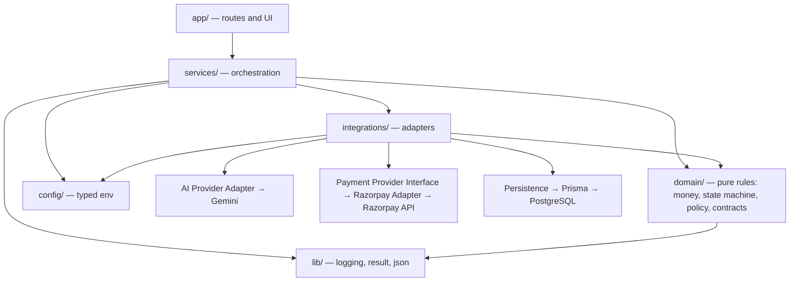

# 02 — Architecture

## A modular monolith, deliberately

This is **one Next.js application, one deployable unit, one database** — with
hard internal module boundaries. It is explicitly **not** a microservice
architecture, and it must not be split into separate services.

The reason is the financial invariant itself. Authorization, the authoritative
amount and the transaction state transition have to happen together, in one
process, against one database, inside one transaction. Distributing them across
services would replace a compiler-checked call with a network hop that can
partially fail — turning "AI cannot bypass the policy engine" from a guarantee
into a hope about retry semantics. A modular monolith gives the same separation
of concerns with none of that risk, and is the right size for this system.

What keeps it modular rather than a big ball of mud: every module below has a
declared contract, an allowed dependency list, and a stated set of things it may
not do. The boundaries are enforced by dependency direction, by the actor-scoped
transition table, and by lint rules — not by process isolation.

## Dependency direction

Dependencies point **inward**. The domain core knows nothing about Next.js,
Razorpay, Gemini, Prisma, or PostgreSQL. That is what allows the financial
rules to be tested exhaustively with no network, no keys and no database.

Rules that keep this acyclic:

- `domain/` imports only from `domain/` and `lib/`. Never from `services/`,
  `integrations/`, `config/` or `app/`. It contains no vendor name.
- `integrations/` imports from `domain/`, `config/` and `lib/`. Never from
  `services/`.
- `services/` may import anything below it, and is the only layer allowed to
  compose an integration with a domain rule.
- `app/` makes no financial decision itself. A route handler parses, delegates
  to **one** service, and maps the result to a response. The server actions in
  `app/actions/purchase.ts` are the one deliberate exception to "one service
  per caller": a purchase is a sequence (buyer agent → product decision →
  policy → inventory → approval), and that sequencing lives there rather than
  behind a single wrapper service. What still never lives in `app/` is a
  decision — every verdict (allowed, requires approval, blocked, reserved,
  refused) is made by the service being called, not by the action itself.

## The module boundaries

Each boundary states its contract, and every one of them is implemented. Where
a module's source path differs from the original sketch, the path below is the
real one.

---

### 1. Buyer Agent — `src/services/buyer-agent/`

|                          |                                                                                                                                                                                                                                                                                                 |
| ------------------------ | ----------------------------------------------------------------------------------------------------------------------------------------------------------------------------------------------------------------------------------------------------------------------------------------------- |
| **Responsibility**       | Turn a natural-language request into a validated structured purchase intent, and later turn a candidate list into a proposed selection with a short explanation.                                                                                                                                |
| **Trusted inputs**       | The catalog projection handed to it by the Merchant Service. The transaction id it is operating within.                                                                                                                                                                                         |
| **Untrusted inputs**     | The user's raw prompt. Every token the model returns. Product titles and descriptions from the catalog, treated as potential prompt injection.                                                                                                                                                  |
| **Outputs**              | `StructuredPurchaseIntent` (schema-validated) and a `BuyerAgentDecision` — a proposed `productId` plus a short reason, or a typed no-match/clarification-needed outcome. **No amount. No authority.**                                                                                           |
| **Allowed dependencies** | AI Provider Adapter, the catalog reader, logger.                                                                                                                                                                                                                                                |
| **Prohibited**           | Computing or asserting a payment amount. Touching the payment provider. Writing transaction state. Reading secrets. Approving anything. Persisting audit events directly. Importing a Gemini type.                                                                                              |
| **Persistence**          | None of its own. Its proposals are recorded by the Transaction and Audit services.                                                                                                                                                                                                              |
| **Security**             | Model output is parsed by a Zod schema before it is read; a parse failure is a normal, audited rejection. `productId` is an untrusted claim until the Merchant Service resolves it. Catalog text may never alter instructions.                                                                  |
| **Called by**            | The `submitRequest` server action (the buyer-facing purchase flow), and directly by the `/api/buyer-agent` route handler — a standalone endpoint that runs the agent and returns its proposal without creating a transaction or touching payment, useful for exercising the agent in isolation. |

---

### 2. AI Provider Adapter — `src/integrations/llm/`

|                          |                                                                                                                                                                                                                                                            |
| ------------------------ | ---------------------------------------------------------------------------------------------------------------------------------------------------------------------------------------------------------------------------------------------------------- |
| **Responsibility**       | The only module that speaks to an external LLM. Sends a prompt envelope, receives a response, and returns a **validated domain object** — never a provider object.                                                                                         |
| **Trusted inputs**       | The prompt envelope built by the caller. Credentials from the config boundary.                                                                                                                                                                             |
| **Untrusted inputs**     | Everything the provider returns.                                                                                                                                                                                                                           |
| **Outputs**              | Validated domain structures only (`StructuredPurchaseIntent`, `BuyerAgentDecision`), or a typed provider error (timeout, invalid response, tool-loop limit, request-budget exceeded).                                                                      |
| **Allowed dependencies** | Config, domain contracts, logger.                                                                                                                                                                                                                          |
| **Prohibited**           | Leaking a Gemini response shape, interaction object, or SDK type past its own boundary. Retrying until a malformed response happens to parse. Making a business decision.                                                                                  |
| **Persistence**          | None.                                                                                                                                                                                                                                                      |
| **Security**             | The chain is fixed: `External LLM Provider → AI Provider Adapter → schema validation → validated domain object → application logic`. Nothing skips a link. Prompt text and any hidden reasoning stay inside this boundary and are never logged or audited. |
| **Called by**            | Buyer Agent and Product Decision Engine only.                                                                                                                                                                                                              |
| **Enables**              | Mocking AI in tests (swap the adapter), replacing the provider, and testing all business logic with no model at all.                                                                                                                                       |

---

### 3. Merchant Service — `src/services/merchant/`

|                          |                                                                                                                                                                                                                                                                                                                                                                                                                                                                          |
| ------------------------ | ------------------------------------------------------------------------------------------------------------------------------------------------------------------------------------------------------------------------------------------------------------------------------------------------------------------------------------------------------------------------------------------------------------------------------------------------------------------------ |
| **Responsibility**       | Own the authoritative product record: price, currency, availability, merchant identity. The read boundary the rest of the system re-reads a product through.                                                                                                                                                                                                                                                                                                             |
| **Trusted inputs**       | PostgreSQL, via the persistence boundary.                                                                                                                                                                                                                                                                                                                                                                                                                                |
| **Untrusted inputs**     | Any `productId` arriving from an agent or a browser.                                                                                                                                                                                                                                                                                                                                                                                                                     |
| **Outputs**              | `CatalogProductDto` / a resolved product row — server-read price, currency, availability and stock — or a typed not-found result.                                                                                                                                                                                                                                                                                                                                        |
| **Allowed dependencies** | Persistence, domain money, logger.                                                                                                                                                                                                                                                                                                                                                                                                                                       |
| **Prohibited**           | Accepting a price from a caller. Accepting an amount as a parameter at all. Any LLM call. Authorization decisions.                                                                                                                                                                                                                                                                                                                                                       |
| **Persistence**          | Products, merchants.                                                                                                                                                                                                                                                                                                                                                                                                                                                     |
| **Security**             | Every read ignores any field the caller supplied except the identifier — price and stock always come from the row, never the request.                                                                                                                                                                                                                                                                                                                                    |
| **Called by**            | The catalog API routes, and — through the Buyer Agent's read-only catalog reader — the Product Decision Engine below, which is the module that actually performs the `PRODUCT_SELECTED → PRODUCT_VERIFIED` re-read and writes that transition. There is no separate "verify one product" call in this module today: verification is the Product Decision Engine re-reading the same authoritative row it read to build the candidate list, immediately before it quotes. |

---

### 4. Agent-Readable Catalog — `src/services/merchant/catalog-service.ts`

|                          |                                                                                                                                                                   |
| ------------------------ | ----------------------------------------------------------------------------------------------------------------------------------------------------------------- |
| **Responsibility**       | Expose a bounded, machine-friendly projection of the catalog that an agent can search and compare over.                                                           |
| **Trusted inputs**       | The product store.                                                                                                                                                |
| **Untrusted inputs**     | Search parameters from the agent.                                                                                                                                 |
| **Outputs**              | A capped list of candidates with stable ids, normalised attributes and display prices.                                                                            |
| **Allowed dependencies** | Persistence, domain money.                                                                                                                                        |
| **Prohibited**           | Returning unbounded result sets. Returning internal cost, margin or supplier data. Acting as the price source for a payment.                                      |
| **Persistence**          | Read-only over products.                                                                                                                                          |
| **Security**             | Result count and text length are capped, so a hostile listing cannot flood the model's context. Descriptions are marked as untrusted data in the prompt envelope. |
| **Called by**            | Buyer Agent, and the catalog route.                                                                                                                               |

---

### 5. Product Decision Engine — `src/services/product-decision/product-decision-service.ts` (`decidePurchase`)

Its real scope is wider than the name suggests: this is the single function
that spans everything from "the agent proposed a product" to "a trusted quote
exists" — opening the transaction, re-verifying, and quoting, all inside one
call. It is where the module boundaries above (Merchant Service verification,
PurchaseQuote issuance, the first two Transaction Service transitions) actually
meet in the current implementation, rather than being separate call sites each
invoked from a shared orchestrator.

|                          |                                                                                                                                                                                                                                                                                                                                       |
| ------------------------ | ------------------------------------------------------------------------------------------------------------------------------------------------------------------------------------------------------------------------------------------------------------------------------------------------------------------------------------- |
| **Responsibility**       | Given an already-proposed product, re-derive it deterministically end to end: open (or resume) the transaction, re-check eligibility against the buyer's own stated authority, re-read the product from PostgreSQL, record `PRODUCT_SELECTION_CONFIRMED` and `PRODUCT_VERIFICATION_SUCCEEDED`, and issue the trusted `PurchaseQuote`. |
| **Trusted inputs**       | The candidate list from the catalog reader. Structured constraints from the validated intent (`PurchaseAuthority`).                                                                                                                                                                                                                   |
| **Untrusted inputs**     | The model's proposed `selectedProductId` and its rationale — checked against the same candidate list the model was given, not trusted as a fact on its own.                                                                                                                                                                           |
| **Outputs**              | A `PurchaseDecisionResult`: a created/opened transaction, its quote, or a typed refusal (`AI_SELECTION_REJECTED`, `REEVALUATION_REQUIRED`, quote-creation failures).                                                                                                                                                                  |
| **Allowed dependencies** | Transaction creation and transition primitives, the buyer agent's catalog reader, the quote service, the deterministic eligibility rules, audit.                                                                                                                                                                                      |
| **Prohibited**           | Treating the model's own ranking as authorization. Computing the payable amount itself — that arithmetic still happens only inside the quote service it calls.                                                                                                                                                                        |
| **Persistence**          | Writes transactions (via the creation service), transitions (via the transition service), and audit events directly, all inside its own database transactions.                                                                                                                                                                        |
| **Security**             | Hard eligibility filters (budget, availability, hard requirements) are applied **deterministically**, both to what the model was shown and to what it picked; a pick outside the eligible set is rejected regardless of the model's stated reason.                                                                                    |
| **Called by**            | The `submitRequest` server action in `src/app/actions/purchase.ts`, after the Buyer Agent has produced a proposal.                                                                                                                                                                                                                    |

---

### 6. PurchaseQuote — `src/services/quote/`

|                          |                                                                                                                                                                                                                                                                                                                                                                        |
| ------------------------ | ---------------------------------------------------------------------------------------------------------------------------------------------------------------------------------------------------------------------------------------------------------------------------------------------------------------------------------------------------------------------- |
| **Responsibility**       | Freeze the verified purchase facts into a single immutable, time-limited record. **The bridge between AI product selection and deterministic policy evaluation.**                                                                                                                                                                                                      |
| **Trusted inputs**       | The product row, re-read from PostgreSQL by `productId` at the moment of quoting (`createTrustedQuote` takes a `productId` and reads it fresh; it is never handed an already-fetched object it must trust).                                                                                                                                                            |
| **Untrusted inputs**     | Nothing. It accepts no amount, no price and no currency from any caller.                                                                                                                                                                                                                                                                                               |
| **Outputs**              | A `PurchaseQuote` holding: transaction id, product id, quantity, **amount in integer minor units**, currency, creation time, expiry time, and optionally a product version reference.                                                                                                                                                                                  |
| **Allowed dependencies** | Persistence, domain money.                                                                                                                                                                                                                                                                                                                                             |
| **Prohibited**           | Being created from an agent proposal directly, without verification in between. Being mutated after creation. Outliving its expiry.                                                                                                                                                                                                                                    |
| **Persistence**          | `PurchaseQuote` (Objective 2 models it).                                                                                                                                                                                                                                                                                                                               |
| **Security**             | Everything downstream — policy, approval, authorization, the payment order — reads the amount from the quote and from nowhere else. That is what makes "the amount cannot come from the browser or the LLM" a single checkable fact rather than a rule repeated at six call sites. Expiry stops a stale price being charged.                                           |
| **Called by**            | The Product Decision Engine, to issue the first quote (`PRODUCT_VERIFIED → QUOTE_CREATED`). The Policy Engine, to validate the current quote is still usable before evaluating it. The Retry Service, to re-quote a stale quote against current facts (`QUOTE_CREATED → QUOTE_CREATED`, self-loop) when a failed payment is retried — see [27](./27-payment-retry.md). |
| **Objectives**           | Objective 2 models it; Objective 6 implements behaviour.                                                                                                                                                                                                                                                                                                               |

---

### 7. Policy / Authorization Engine — `src/domain/policy/`, `src/services/policy/`

|                          |                                                                                                                                                                                                                                                                                                                                                                           |
| ------------------------ | ------------------------------------------------------------------------------------------------------------------------------------------------------------------------------------------------------------------------------------------------------------------------------------------------------------------------------------------------------------------------- |
| **Responsibility**       | Decide, deterministically, whether a **quoted** amount may be paid without a human: one buyer-level auto-approve ceiling and an auto-purchase on/off flag. There is one authorization policy per buyer today, not per-transaction caps, category rules or velocity limits — the module boundary is designed to grow those without changing its shape, but none exist yet. |
| **Trusted inputs**       | The `PurchaseQuote`. The stored `AuthorizationPolicy`.                                                                                                                                                                                                                                                                                                                    |
| **Untrusted inputs**     | Nothing. It refuses caller-supplied amounts and caller-supplied policies.                                                                                                                                                                                                                                                                                                 |
| **Outputs**              | `PolicyDecision.decision` = `ALLOWED` \| `APPROVAL_REQUIRED` \| `BLOCKED`, plus the reason code, the policy id and version, and the evaluated amount.                                                                                                                                                                                                                     |
| **Allowed dependencies** | Domain money, the currency vocabulary. Pure — `evaluatePolicy` itself takes no database handle, no clock, and makes no call at all.                                                                                                                                                                                                                                       |
| **Prohibited**           | Any LLM call. Any network call. Any payment call. Being reachable from the agent's tool surface.                                                                                                                                                                                                                                                                          |
| **Persistence**          | The service layer around it reads the policy row and writes the decision as an audit event; the pure function itself persists nothing.                                                                                                                                                                                                                                    |
| **Security**             | This is the gate. It is total: every input maps to exactly one of the three outcomes, `ALLOWED` is produced in exactly one place after every check has passed, and there is deliberately no amount-based `BLOCKED` — an amount above the ceiling escalates to `APPROVAL_REQUIRED`, never a silent refusal.                                                                |
| **Called by**            | The `submitRequest` server action, for the first evaluation. The Retry Service, to re-evaluate against a freshly re-quoted amount when a stale quote is retried.                                                                                                                                                                                                          |

---

### 8. Human Approval Gate — `src/services/approval/`

|                          |                                                                                                                                                                                                                                                      |
| ------------------------ | ---------------------------------------------------------------------------------------------------------------------------------------------------------------------------------------------------------------------------------------------------- |
| **Responsibility**       | Hold a transaction that policy marked `requires_approval` until a human explicitly approves or denies a specific quoted amount, and expire it otherwise.                                                                                             |
| **Trusted inputs**       | An authenticated human action.                                                                                                                                                                                                                       |
| **Untrusted inputs**     | The approval request payload from the browser.                                                                                                                                                                                                       |
| **Outputs**              | `approval_granted` or `approval_denied`, bound to one transaction, one quote and one approver.                                                                                                                                                       |
| **Allowed dependencies** | Persistence, transaction service, audit.                                                                                                                                                                                                             |
| **Prohibited**           | Auto-approval of any kind. Approval by a non-human actor. Approving an amount different from the quoted one.                                                                                                                                         |
| **Persistence**          | `ApprovalRequest`, with an expiry.                                                                                                                                                                                                                   |
| **Security**             | The transition table grants `APPROVAL_REQUIRED → AUTHORIZED` to `approval_gate` alone, so no agent path can reach it. The acknowledged amount is re-compared to the quote before the authorization stands.                                           |
| **Called by**            | The `submitRequest`, `approvePurchase` and `rejectPurchase` server actions in `src/app/actions/purchase.ts`. There is no separate `/api/.../approvals` route today; the approval flow is server-action only, matching every other buyer-facing step. |

---

### 9. Inventory Reservation — `src/services/inventory/`

|                          |                                                                                                                                                                                                                                                                                                                                                                                                                                                                                                                                                                                                                                                                                                                                                                                                                                                 |
| ------------------------ | ----------------------------------------------------------------------------------------------------------------------------------------------------------------------------------------------------------------------------------------------------------------------------------------------------------------------------------------------------------------------------------------------------------------------------------------------------------------------------------------------------------------------------------------------------------------------------------------------------------------------------------------------------------------------------------------------------------------------------------------------------------------------------------------------------------------------------------------------- |
| **Responsibility**       | Hold stock for an authorized transaction **before** money moves, then commit it on completion or release it on failure.                                                                                                                                                                                                                                                                                                                                                                                                                                                                                                                                                                                                                                                                                                                         |
| **Trusted inputs**       | An existing authorization and its quote.                                                                                                                                                                                                                                                                                                                                                                                                                                                                                                                                                                                                                                                                                                                                                                                                        |
| **Untrusted inputs**     | Nothing.                                                                                                                                                                                                                                                                                                                                                                                                                                                                                                                                                                                                                                                                                                                                                                                                                                        |
| **Outputs**              | An `InventoryReservation` with an expiry, or a typed "unavailable" failure.                                                                                                                                                                                                                                                                                                                                                                                                                                                                                                                                                                                                                                                                                                                                                                     |
| **Allowed dependencies** | Persistence, domain money, logger.                                                                                                                                                                                                                                                                                                                                                                                                                                                                                                                                                                                                                                                                                                                                                                                                              |
| **Prohibited**           | Being skipped on the way to a payment. Being created or released by an AI actor. Reserving more than is available.                                                                                                                                                                                                                                                                                                                                                                                                                                                                                                                                                                                                                                                                                                                              |
| **Persistence**          | `InventoryReservation` (Objective 2 models it).                                                                                                                                                                                                                                                                                                                                                                                                                                                                                                                                                                                                                                                                                                                                                                                                 |
| **Security**             | This exists to close the **check-then-charge race**: verifying stock and then charging leaves a window in which another buyer takes the last unit, and the customer is charged for something that cannot ship. The rule the transition table enforces is narrower than "no edge exists" — it is that a payment state can only be reached with stock genuinely held. `AUTHORIZED` has exactly one edge to `PAYMENT_ORDER_CREATED` that does not pass through `INVENTORY_RESERVED` first, and it is restricted to a controlled retry rebinding a hold that was claimed before the transaction's _first_ payment attempt and never released (see [27](./27-payment-retry.md)) — it is not a second, independent way to reach a payment state without ever holding stock. `holdsInventory(state)` names every state in which a hold is outstanding. |
| **Called by**            | The `reserveStock` server action, for the first reservation. The Retry Service, to rebind a surviving reservation onto a fresh quote. The Webhook Service, to commit a reservation on capture or release it on a workflow-ending failure.                                                                                                                                                                                                                                                                                                                                                                                                                                                                                                                                                                                                       |

---

### 10. Transaction Service — `src/services/transaction/`

Thinner than the name suggests, and worth stating plainly: **this module does
not orchestrate the purchase flow.** It is three narrow, shared primitives that
every other service calls into to do its own piece of the lifecycle — there is
no central function that calls the buyer agent, the quote service, the policy
engine, the approval gate, the reservation service and the payment provider in
sequence. That sequencing lives in `src/app/actions/purchase.ts` (for the
buyer-facing steps) and inside each `src/services/payment/*` service (for the
payment steps); each of those calls `applyTransactionEvent(Within)` directly,
as part of its own atomic database transaction, to record the one transition
its own step is responsible for.

|                          |                                                                                                                                                                                                                                                                                                                                                      |
| ------------------------ | ---------------------------------------------------------------------------------------------------------------------------------------------------------------------------------------------------------------------------------------------------------------------------------------------------------------------------------------------------- |
| **Responsibility**       | `creation-service.ts` — the only creator of `Transaction` rows. `transition-service.ts` — the only writer of `Transaction.status`, via `applyTransactionEvent`/`applyTransactionEventWithin`, which every other service calls to record its own step. `overview-service.ts` — the read model the transaction page renders.                           |
| **Trusted inputs**       | Its own database rows. The `TransitionRequest` passed by the calling service.                                                                                                                                                                                                                                                                        |
| **Untrusted inputs**     | None of its own — every transition request already comes from a service that has done its own validation; this module's job is to adjudicate the edge and the actor regardless of who's asking.                                                                                                                                                      |
| **Outputs**              | Persisted transactions, state transitions and transition history.                                                                                                                                                                                                                                                                                    |
| **Allowed dependencies** | `creation-service.ts` and `transition-service.ts`: persistence, the domain state machine, `lib` — nothing else, and no other service module. `overview-service.ts` is the one exception, and only as a **reader**: it composes the audit, quote, policy and retry read boundaries to build the page's view model, but writes nothing to any of them. |
| **Prohibited**           | Interpreting natural language. Ranking products. Making an authorization decision. Naming a payment vendor. `creation-service.ts`/`transition-service.ts` calling into any other service — the dependency arrow there points the other way, with every other service calling _into_ them.                                                            |
| **Persistence**          | `Transaction`, plus `TransactionStateTransition`.                                                                                                                                                                                                                                                                                                    |
| **Security**             | Every write goes through `resolveTransition`, which checks both the edge and the actor. Idempotency keys are stored so a replayed request cannot double-write.                                                                                                                                                                                       |
| **Called by**            | Nearly every other service — the Product Decision Engine, the Policy Engine, the Approval Gate, the Inventory Reservation service, and every `src/services/payment/*` service — each calling the transition-writing primitive to record its own step. `overview-service.ts` alone is called by the transaction page.                                 |

---

### 11. Transaction State Machine — `src/domain/transaction/`

|                          |                                                                                                                                                                                                                                              |
| ------------------------ | -------------------------------------------------------------------------------------------------------------------------------------------------------------------------------------------------------------------------------------------- |
| **Responsibility**       | Define the legal lifecycle and adjudicate every requested transition against both the edge and the requesting actor.                                                                                                                         |
| **Trusted inputs**       | None — it trusts nothing and is pure.                                                                                                                                                                                                        |
| **Untrusted inputs**     | `TransitionRequest`.                                                                                                                                                                                                                         |
| **Outputs**              | `TransitionDecision` — one of `APPLY`, `IDEMPOTENT_NO_OP`, `INVALID`, or `LATE_EVENT_RECONCILIATION_CANDIDATE`. See [17](./17-transaction-state-machine.md).                                                                                 |
| **Allowed dependencies** | Its own sibling modules (`events.ts`, `states.ts`, `transitions.ts`). Nothing else.                                                                                                                                                          |
| **Prohibited**           | I/O of any kind. Persistence. Knowing what Razorpay, Gemini, Prisma or PostgreSQL are.                                                                                                                                                       |
| **Persistence**          | None.                                                                                                                                                                                                                                        |
| **Security**             | The single authoritative definition of transaction states. No competing enum may exist anywhere, including in the eventual Prisma schema, which must be generated from or matched to this list. See [05](./05-transaction-state-machine.md). |
| **Called by**            | Transaction Service.                                                                                                                                                                                                                         |

---

### 12. Transaction State Transition History — the `TransactionStateTransition` model

|                          |                                                                                                                                                                                                                                                                                              |
| ------------------------ | -------------------------------------------------------------------------------------------------------------------------------------------------------------------------------------------------------------------------------------------------------------------------------------------- |
| **Responsibility**       | Persist not just `Transaction.currentState` but **every** transition: previous state, next state, actor, reason, timestamp.                                                                                                                                                                  |
| **Trusted inputs**       | An `APPLY` decision from the state machine.                                                                                                                                                                                                                                                  |
| **Untrusted inputs**     | None.                                                                                                                                                                                                                                                                                        |
| **Outputs**              | An append-only `TransactionStateTransition` row per accepted transition.                                                                                                                                                                                                                     |
| **Allowed dependencies** | Persistence.                                                                                                                                                                                                                                                                                 |
| **Prohibited**           | Updates. Deletes. Being written for a _rejected_ transition (those are audit events, not history).                                                                                                                                                                                           |
| **Persistence**          | `TransactionStateTransition` (Objective 2 models it).                                                                                                                                                                                                                                        |
| **Security**             | A current-state-only model cannot answer "how did this transaction get here", which is exactly the question a payment dispute, a reconciliation job, a debugging session and a judge all ask. Storing the path makes the lifecycle replayable and makes a silent out-of-order write visible. |
| **Called by**            | Transaction Service, on every accepted transition.                                                                                                                                                                                                                                           |
| **Objectives**           | Objective 2 models it; Objective 3 implements behaviour.                                                                                                                                                                                                                                     |

---

### 13. Payment Provider Interface — `src/domain/payment/provider.ts`

|                          |                                                                                                                                                                                                                                                                                                                                                  |
| ------------------------ | ------------------------------------------------------------------------------------------------------------------------------------------------------------------------------------------------------------------------------------------------------------------------------------------------------------------------------------------------ |
| **Responsibility**       | The **vendor-neutral** `PaymentProvider` contract: create a payment order, verify a checkout signature, verify a webhook signature.                                                                                                                                                                                                              |
| **Trusted inputs**       | The authorized amount, taken from the `PurchaseQuote`.                                                                                                                                                                                                                                                                                           |
| **Untrusted inputs**     | Everything a provider returns.                                                                                                                                                                                                                                                                                                                   |
| **Outputs**              | Domain shapes only: `ProviderOrder`, `ProviderOrderOutcome`, `ProviderFailure`; `verifyCheckoutSignature`/`verifyWebhookSignature` return a plain `boolean`, never a provider object.                                                                                                                                                            |
| **Allowed dependencies** | Config, domain money, logger.                                                                                                                                                                                                                                                                                                                    |
| **Prohibited**           | Exposing any provider type, provider error, or provider id format in its signatures.                                                                                                                                                                                                                                                             |
| **Security**             | The chain is `payment/* services → Payment Provider Interface → Razorpay Adapter → Razorpay API`. The domain depends on the middle link only. The domain core does not contain the string "razorpay" — a test asserts this for the state machine's actor vocabulary, which is why the actors are named `payment_provider` and `payment_webhook`. |
| **Called by**            | The `src/services/payment/*` family — `checkout-service.ts`, `payment-order-service.ts`, `retry-service.ts` and `webhook-service.ts` — each of which holds its own `PaymentProvider` instance rather than reaching it through a shared orchestrator.                                                                                             |

---

### 14. Razorpay Adapter — `src/integrations/payments/razorpay-provider.ts`

|                          |                                                                                                                                                                                                                                                                                                                                                                                                                                     |
| ------------------------ | ----------------------------------------------------------------------------------------------------------------------------------------------------------------------------------------------------------------------------------------------------------------------------------------------------------------------------------------------------------------------------------------------------------------------------------- |
| **Responsibility**       | The single implementation of the Payment Provider Interface. The only code that imports a Razorpay SDK or calls a Razorpay URL.                                                                                                                                                                                                                                                                                                     |
| **Trusted inputs**       | Razorpay credentials from the config boundary.                                                                                                                                                                                                                                                                                                                                                                                      |
| **Untrusted inputs**     | Every Razorpay response body and every webhook payload, until parsed and verified.                                                                                                                                                                                                                                                                                                                                                  |
| **Outputs**              | Domain shapes, per the interface above.                                                                                                                                                                                                                                                                                                                                                                                             |
| **Allowed dependencies** | Config, domain money, logger.                                                                                                                                                                                                                                                                                                                                                                                                       |
| **Prohibited**           | Deciding whether a payment is allowed. Computing an amount. Being called by the agent, by a route handler, or by the domain. Letting the key secret cross its own boundary.                                                                                                                                                                                                                                                         |
| **Persistence**          | None directly; `PaymentAttempt` rows are written by `src/services/payment/payment-order-service.ts`, which calls this adapter.                                                                                                                                                                                                                                                                                                      |
| **Security**             | Amounts are passed in minor units exactly as quoted, so no conversion step exists where a rounding bug could live. Razorpay-specific concerns — order parameters, provider ids, provider error codes, capture semantics, signature format — stay entirely inside this folder.                                                                                                                                                       |
| **Status**               | Implemented and production-proven in Razorpay **Test Mode**: real order creation, real checkout signature verification and real webhook capture have all been exercised against the deployed environment, including a genuine bank decline, a controlled retry, and a duplicate webhook redelivery handled safely. See [24](./24-payment-order-creation.md) and [25](./25-checkout-and-verification.md) for the verified specifics. |

---

### 15. Webhook Handler — `src/app/api/webhooks/razorpay/` and `src/services/payment/webhook-service.ts`

|                          |                                                                                                                                                                                                                                                                                                                                                   |
| ------------------------ | ------------------------------------------------------------------------------------------------------------------------------------------------------------------------------------------------------------------------------------------------------------------------------------------------------------------------------------------------- |
| **Responsibility**       | Accept inbound provider events, verify them, deduplicate them, and translate verified events into transaction transitions.                                                                                                                                                                                                                        |
| **Trusted inputs**       | Nothing on arrival.                                                                                                                                                                                                                                                                                                                               |
| **Untrusted inputs**     | The entire request: body, headers, signature, timing, ordering.                                                                                                                                                                                                                                                                                   |
| **Outputs**              | A stored `WebhookEvent` and, when the event is new and valid, one transition request as actor `payment_webhook`.                                                                                                                                                                                                                                  |
| **Allowed dependencies** | Config, persistence, payment provider interface (for verification), transaction service, audit.                                                                                                                                                                                                                                                   |
| **Prohibited**           | Trusting the payload before signature verification. Reprocessing a `providerEventId` already seen. Assuming events arrive in order or exactly once.                                                                                                                                                                                               |
| **Persistence**          | `WebhookEvent`, keyed uniquely on the provider event id.                                                                                                                                                                                                                                                                                          |
| **Security**             | The order of operations is fixed: read the raw body, verify the HMAC against the raw bytes, parse, deduplicate, then act. Duplicates still return a success status so the provider stops retrying.                                                                                                                                                |
| **Called by**            | The payment provider, over the public internet.                                                                                                                                                                                                                                                                                                   |
| **Status**               | Implemented: `payment.captured` and `payment.failed` are handled, deduplicated by `(provider, externalEventId)`, and this has been exercised against the deployed environment with a genuine duplicate redelivery of a real capture event, recorded as `webhook_duplicate` and applied exactly once. See [25](./25-checkout-and-verification.md). |

---

### 16. Persistence — `src/integrations/persistence/`

|                          |                                                                                                                                                                                                                                                           |
| ------------------------ | --------------------------------------------------------------------------------------------------------------------------------------------------------------------------------------------------------------------------------------------------------- |
| **Responsibility**       | The only module that talks to PostgreSQL, through Prisma. Owns the client lifecycle, transactions and connection strategy.                                                                                                                                |
| **Trusted inputs**       | `DATABASE_URL` and optional `DIRECT_URL` from the config boundary.                                                                                                                                                                                        |
| **Untrusted inputs**     | None; callers pass already-validated domain values.                                                                                                                                                                                                       |
| **Outputs**              | Typed domain entities.                                                                                                                                                                                                                                    |
| **Allowed dependencies** | Config, domain types, logger.                                                                                                                                                                                                                             |
| **Prohibited**           | Being imported by a React component, a UI module, or anything in `app/` other than through a service. Running in a client bundle. Leaking a Prisma model type into the domain core.                                                                       |
| **Security**             | **Server-only, always.** A pooled connection serves runtime requests; a direct connection is used for migrations, because poolers generally cannot run DDL. Money columns are always an integer plus an explicit currency — see [08](./08-data-model.md). |
| **Called by**            | Services only.                                                                                                                                                                                                                                            |
| **To verify**            | Confirmed in Objective 2 and re-confirmed after the move to Neon: the runtime uses Neon's pooled endpoint, and `npm run db:verify:staging` refuses a `DATABASE_URL` that does not name a pooler.                                                          |

---

### 17. Audit / Event Service — `src/services/audit/`

|                          |                                                                                                                               |
| ------------------------ | ----------------------------------------------------------------------------------------------------------------------------- |
| **Responsibility**       | Keep an append-only record of what happened to a user's money, complete enough to reconstruct any transaction end to end.     |
| **Trusted inputs**       | Events emitted by services, each already redaction-safe.                                                                      |
| **Untrusted inputs**     | Free-text detail fields, which are length-capped and scrubbed.                                                                |
| **Outputs**              | Persisted `AuditEvent`s, and an ordered timeline per transaction.                                                             |
| **Allowed dependencies** | Persistence, redaction, contracts.                                                                                            |
| **Prohibited**           | Updates or deletes. Storing secrets, card data, or model chain-of-thought. Being used as the operational log, or the reverse. |
| **Persistence**          | `AuditEvent`, append-only.                                                                                                    |
| **Security**             | Everything written passes the same redaction used by the logger. See [11](./11-explainability-and-audit.md).                  |
| **Called by**            | Every service, at each consequential step.                                                                                    |

## Independent testability

Each boundary is testable alone. The domain modules are pure. The services take
their collaborators as parameters, so a test supplies a fake merchant, a fake AI
adapter or a fake payment adapter. The integrations are the only modules that
touch the network or the database, and they are replaced wholesale in service
tests.
