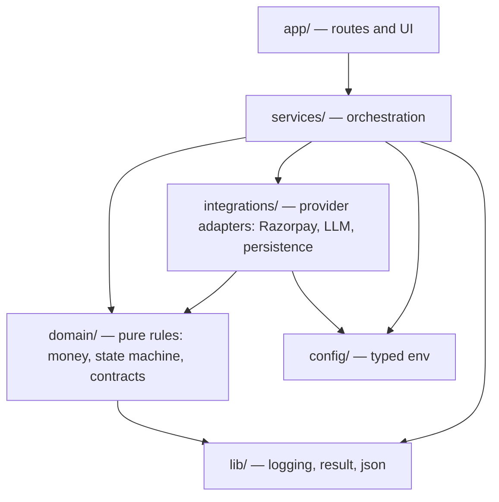

# 02 — Architecture

## Dependency direction

Dependencies point **inward**. The domain core knows nothing about Next.js,
Razorpay, Anthropic, or the database. That is what allows the financial rules to
be tested exhaustively with no network, no keys and no framework.

Rules that keep this acyclic:

- `domain/` imports only from `domain/` and `lib/`. Never from `services/`,
  `integrations/`, `config/` or `app/`.
- `integrations/` imports from `domain/`, `config/` and `lib/`. Never from
  `services/`.
- `services/` may import anything below it, and is the only layer allowed to
  compose an integration with a domain rule.
- `app/` contains no business logic. A route handler parses, delegates to one
  service, and maps the result to a response.

## The eleven module boundaries

Each boundary below states its contract. Only the parts marked **implemented**
exist today; the rest is the design later objectives must build to.

---

### 1. Buyer Agent — `src/services/buyer-agent/` _(not implemented)_

|                          |                                                                                                                                                                                                                                |
| ------------------------ | ------------------------------------------------------------------------------------------------------------------------------------------------------------------------------------------------------------------------------ |
| **Responsibility**       | Turn a natural-language request into a validated structured purchase intent, and later turn a candidate list into a proposed selection with a short explanation.                                                               |
| **Trusted inputs**       | The catalog projection handed to it by the Merchant Service. The transaction id it is operating within.                                                                                                                        |
| **Untrusted inputs**     | The user's raw prompt. Every token the model returns. Product titles and descriptions from the catalog, treated as potential prompt injection.                                                                                 |
| **Outputs**              | `PurchaseIntent` (schema-validated) and `ProductProposal` (`productId` plus a short reason). **No amount. No authority.**                                                                                                      |
| **Allowed dependencies** | LLM provider adapter, catalog read projection, decision-record contract, logger.                                                                                                                                               |
| **Prohibited**           | Computing or asserting a payment amount. Calling Razorpay. Writing transaction state. Reading secrets. Approving anything. Persisting audit events directly.                                                                   |
| **Persistence**          | None of its own. Its proposals are recorded by the Transaction and Audit services.                                                                                                                                             |
| **Security**             | Model output is parsed by a Zod schema before it is read; a parse failure is a normal, audited rejection. `productId` is an untrusted claim until the Merchant Service resolves it. Catalog text may never alter instructions. |
| **Called by**            | The intent and decision services. Never by a route handler directly.                                                                                                                                                           |

---

### 2. Merchant Service — `src/services/merchant/` _(not implemented)_

|                          |                                                                                                                                         |
| ------------------------ | --------------------------------------------------------------------------------------------------------------------------------------- |
| **Responsibility**       | Own the authoritative product record: price, currency, availability, merchant identity. Answer "what is this product, really?"          |
| **Trusted inputs**       | The datastore.                                                                                                                          |
| **Untrusted inputs**     | Any `productId` arriving from an agent or a browser.                                                                                    |
| **Outputs**              | `VerifiedProduct` — the resolved product with server-read `Money` and stock, or a typed verification failure.                           |
| **Allowed dependencies** | Persistence, domain money, logger.                                                                                                      |
| **Prohibited**           | Accepting a price from a caller. Accepting an amount as a parameter at all. Any LLM call. Authorization decisions.                      |
| **Persistence**          | Products, merchants.                                                                                                                    |
| **Security**             | This is invariants 4 and 5. Verification re-reads from the datastore and ignores every field the caller supplied except the identifier. |
| **Called by**            | Transaction Service, during `PRODUCT_SELECTED -> PRODUCT_VERIFIED`.                                                                     |

---

### 3. Agent-Readable Catalog — `src/services/merchant/catalog.ts` _(not implemented)_

|                          |                                                                                                                                                                                                                    |
| ------------------------ | ------------------------------------------------------------------------------------------------------------------------------------------------------------------------------------------------------------------ |
| **Responsibility**       | Expose a bounded, machine-friendly projection of the catalog that an agent can search and compare over.                                                                                                            |
| **Trusted inputs**       | The product store.                                                                                                                                                                                                 |
| **Untrusted inputs**     | Search parameters from the agent.                                                                                                                                                                                  |
| **Outputs**              | A capped list of candidates with stable ids, normalised attributes and display prices.                                                                                                                             |
| **Allowed dependencies** | Persistence, domain money.                                                                                                                                                                                         |
| **Prohibited**           | Returning unbounded result sets. Returning internal cost, margin or supplier data. Acting as the price source for a payment — the projection is for comparison, and the amount charged is re-read at verification. |
| **Persistence**          | Read-only over products.                                                                                                                                                                                           |
| **Security**             | Result count and text length are capped, so a hostile listing cannot flood the model's context. Descriptions are marked as untrusted data in the prompt envelope.                                                  |
| **Called by**            | Buyer Agent, and the catalog route.                                                                                                                                                                                |

---

### 4. Product Decision Engine — `src/services/product-decision/` _(not implemented)_

|                          |                                                                                                                                                                                   |
| ------------------------ | --------------------------------------------------------------------------------------------------------------------------------------------------------------------------------- |
| **Responsibility**       | Reduce a candidate set to one selection under the user's stated constraints, and emit a `DecisionRecord` explaining the choice.                                                   |
| **Trusted inputs**       | Candidate list from the catalog. Structured constraints from the validated intent.                                                                                                |
| **Untrusted inputs**     | The model's ranking rationale.                                                                                                                                                    |
| **Outputs**              | `ProductSelection` (`productId`, rank, reason) plus a decision record.                                                                                                            |
| **Allowed dependencies** | Buyer Agent, catalog projection, decision-record contract.                                                                                                                        |
| **Prohibited**           | Treating its own selection as authorised. Bypassing verification. Producing an amount.                                                                                            |
| **Persistence**          | Decision records, via the Audit Service.                                                                                                                                          |
| **Security**             | Hard filters (budget, availability) are applied **deterministically** both before and after the model ranks. The model orders what survives; it does not decide what is eligible. |
| **Called by**            | Transaction Service.                                                                                                                                                              |

---

### 5. Policy / Authorization Engine — `src/domain/policy/` _(not implemented; contracts in place)_

|                          |                                                                                                                                                             |
| ------------------------ | ----------------------------------------------------------------------------------------------------------------------------------------------------------- |
| **Responsibility**       | Decide, deterministically, whether a verified amount may be paid: budget ceiling, per-transaction cap, category rules, approval threshold, velocity limits. |
| **Trusted inputs**       | `VerifiedProduct` from the Merchant Service. The stored `AuthorizationPolicy`.                                                                              |
| **Untrusted inputs**     | Nothing. It refuses caller-supplied amounts and caller-supplied policies.                                                                                   |
| **Outputs**              | `PolicyDecision` = `allowed` \| `requires_approval` \| `blocked`, plus the rule id and a `DecisionRecord`.                                                  |
| **Allowed dependencies** | Domain money, decision-record contract. Pure, apart from a policy read.                                                                                     |
| **Prohibited**           | Any LLM call. Any network call. Any Razorpay call. Being reachable from the agent's tool surface.                                                           |
| **Persistence**          | Reads policies; writes only decisions.                                                                                                                      |
| **Security**             | This is the gate. It must be pure and total: every input maps to one of the three outcomes, and anything unrecognised defaults to `blocked`.                |
| **Called by**            | Transaction Service only.                                                                                                                                   |

---

### 6. Human Approval Gate — `src/services/approval/` _(not implemented)_

|                          |                                                                                                                                                                                                                                 |
| ------------------------ | ------------------------------------------------------------------------------------------------------------------------------------------------------------------------------------------------------------------------------- |
| **Responsibility**       | Hold a transaction that policy marked `requires_approval` until a human explicitly approves or denies a specific amount, and expire it otherwise.                                                                               |
| **Trusted inputs**       | An authenticated human action.                                                                                                                                                                                                  |
| **Untrusted inputs**     | The approval request payload from the browser.                                                                                                                                                                                  |
| **Outputs**              | `approval_granted` or `approval_denied`, bound to one transaction, one amount and one approver.                                                                                                                                 |
| **Allowed dependencies** | Persistence, transaction service, audit.                                                                                                                                                                                        |
| **Prohibited**           | Auto-approval of any kind. Approval by a non-human actor. Approving an amount different from the one shown to the human.                                                                                                        |
| **Persistence**          | `ApprovalRequest`, with an expiry.                                                                                                                                                                                              |
| **Security**             | Invariant 14. The transition table grants `APPROVAL_REQUIRED -> AUTHORIZED` to `approval_gate` alone, so no agent path can reach it. The approved amount is re-compared to the verified amount before the authorization stands. |
| **Called by**            | Approval routes.                                                                                                                                                                                                                |

---

### 7. Transaction Service — `src/services/transaction/` _(not implemented; state machine in place)_

|                          |                                                                                                                                                                               |
| ------------------------ | ----------------------------------------------------------------------------------------------------------------------------------------------------------------------------- |
| **Responsibility**       | Own the transaction record and its state, and orchestrate the flow. It is the only writer of transaction state.                                                               |
| **Trusted inputs**       | Its own datastore. Results returned by the modules it calls.                                                                                                                  |
| **Untrusted inputs**     | Every request to change state, regardless of origin.                                                                                                                          |
| **Outputs**              | Persisted transactions and state transitions, with an audit event for each.                                                                                                   |
| **Allowed dependencies** | Everything below it: domain state machine, merchant, policy, approval, Razorpay integration, audit.                                                                           |
| **Prohibited**           | Interpreting natural language. Ranking products. Making authorization decisions itself — it asks the policy engine.                                                           |
| **Persistence**          | `Transaction`, plus the transition log.                                                                                                                                       |
| **Security**             | Invariant 12. Every write goes through `evaluateTransition`, which checks both the edge and the actor. Idempotency keys are stored so a replayed request cannot double-write. |
| **Called by**            | Route handlers, the webhook handler, the approval gate.                                                                                                                       |

---

### 8. Razorpay Integration Service — `src/integrations/razorpay/` _(not implemented)_

|                          |                                                                                                                                                                                                                                    |
| ------------------------ | ---------------------------------------------------------------------------------------------------------------------------------------------------------------------------------------------------------------------------------- |
| **Responsibility**       | The only place that speaks HTTP to Razorpay: create orders, fetch payments, verify payment signatures.                                                                                                                             |
| **Trusted inputs**       | The authorized amount handed to it by the Transaction Service. Razorpay credentials from the config boundary.                                                                                                                      |
| **Untrusted inputs**     | Every response body Razorpay returns, until parsed and validated.                                                                                                                                                                  |
| **Outputs**              | Domain-shaped results (`PaymentOrder`, `PaymentOutcome`). Never a raw provider object.                                                                                                                                             |
| **Allowed dependencies** | Config, domain money, logger.                                                                                                                                                                                                      |
| **Prohibited**           | Deciding whether a payment is allowed. Computing an amount. Being called by the agent. Letting the key secret cross its own boundary.                                                                                              |
| **Persistence**          | None directly; `PaymentAttempt` rows are written by the Transaction Service.                                                                                                                                                       |
| **Security**             | Amounts are passed in minor units exactly as authorized, so no conversion step exists where a rounding bug could live. The key secret never leaves the server. Signature verification uses a constant-time comparison.             |
| **Called by**            | Transaction Service only.                                                                                                                                                                                                          |
| **To verify**            | Exact order-creation parameters, capture semantics (automatic vs manual) and the signature payload format are _to be verified during the Razorpay integration objective_ against current Razorpay documentation, not assumed here. |

---

### 9. Razorpay Webhook Handler — `src/app/api/webhooks/razorpay/` and `src/services/webhook/` _(not implemented)_

|                          |                                                                                                                                                                                                                                             |
| ------------------------ | ------------------------------------------------------------------------------------------------------------------------------------------------------------------------------------------------------------------------------------------- |
| **Responsibility**       | Accept inbound Razorpay events, verify them, deduplicate them, and translate verified events into transaction transitions.                                                                                                                  |
| **Trusted inputs**       | Nothing on arrival.                                                                                                                                                                                                                         |
| **Untrusted inputs**     | The entire request: body, headers, signature, timing, ordering.                                                                                                                                                                             |
| **Outputs**              | A stored `WebhookEvent` and, when the event is new and valid, one transition request.                                                                                                                                                       |
| **Allowed dependencies** | Config (webhook secret), persistence, transaction service, audit.                                                                                                                                                                           |
| **Prohibited**           | Trusting the payload before signature verification. Reprocessing a `providerEventId` already seen. Assuming events arrive in order or exactly once.                                                                                         |
| **Persistence**          | `WebhookEvent`, keyed uniquely on the provider event id.                                                                                                                                                                                    |
| **Security**             | The order of operations is fixed: read the raw body, verify the HMAC against the raw bytes, parse, deduplicate, then act. Verification happens before parsing, and duplicates still return a success status so the provider stops retrying. |
| **Called by**            | Razorpay, over the public internet.                                                                                                                                                                                                         |
| **To verify**            | Header name, signature algorithm and the exact retry and ordering guarantees are _to be verified during the Razorpay integration objective_.                                                                                                |

---

### 10. Transaction State Machine — `src/domain/transaction/` _(implemented)_

|                          |                                                                                                                      |
| ------------------------ | -------------------------------------------------------------------------------------------------------------------- |
| **Responsibility**       | Define the legal lifecycle and adjudicate every requested transition against both the edge and the requesting actor. |
| **Trusted inputs**       | None — it trusts nothing and is pure.                                                                                |
| **Untrusted inputs**     | `TransitionRequest`.                                                                                                 |
| **Outputs**              | `Result<TransitionApproval, TransitionRejection>`.                                                                   |
| **Allowed dependencies** | `domain/errors`, `domain/identifiers`, `lib/result`. Nothing else.                                                   |
| **Prohibited**           | I/O of any kind. Persistence. Knowing what Razorpay is.                                                              |
| **Persistence**          | None.                                                                                                                |
| **Security**             | Invariants 13 and 14 live here as data rather than prose. See [05](./05-transaction-state-machine.md).               |
| **Called by**            | Transaction Service.                                                                                                 |

---

### 11. Audit / Event Service — `src/services/audit/` _(not implemented; contract in place)_

|                          |                                                                                                                               |
| ------------------------ | ----------------------------------------------------------------------------------------------------------------------------- |
| **Responsibility**       | Keep an append-only record of what happened to a user's money, complete enough to reconstruct any transaction end to end.     |
| **Trusted inputs**       | Events emitted by services, each already redaction-safe.                                                                      |
| **Untrusted inputs**     | Free-text detail fields, which are length-capped and scrubbed.                                                                |
| **Outputs**              | Persisted `AuditEvent`s, and an ordered timeline per transaction.                                                             |
| **Allowed dependencies** | Persistence, redaction, contracts.                                                                                            |
| **Prohibited**           | Updates or deletes. Storing secrets, card data, or model chain-of-thought. Being used as the operational log, or the reverse. |
| **Persistence**          | `AuditEvent`, append-only.                                                                                                    |
| **Security**             | Invariant 16. Everything written passes the same redaction used by the logger. See [11](./11-explainability-and-audit.md).    |
| **Called by**            | Every service, at each consequential step.                                                                                    |

## Independent testability

Each boundary is testable alone. The domain modules are pure. The services take
their collaborators as parameters, so a test supplies a fake merchant or a fake
Razorpay adapter. The integrations are the only modules that touch the network,
and they are replaced wholesale in service tests.
