# 03 — AI vs deterministic control

The system has exactly two halves, and the line between them is the product.

```mermaid
graph LR
  subgraph AI["AI domain — proposes"]
    A1[Interpret natural language]
    A2[Interpret preferences]
    A3[Reason over candidates]
    A4[Draft a user-facing explanation]
  end

  subgraph GATE["Validation boundary"]
    G0[AI Provider Adapter]
    G1[Schema validation]
    G2[Server-side product verification]
    G3[PurchaseQuote freezes the amount]
  end

  subgraph DET["Deterministic domain — decides and executes"]
    D1[Authoritative price and inventory]
    D2[Budget and policy rules]
    D3[Authorization]
    D4[Payment amount]
    D5[Razorpay calls and verification]
    D6[State transitions and idempotency]
    D7[Audit persistence]
  end

  AI --> GATE --> DET
  DET -.->|"never the reverse"| AI
```

## AI domain

The LLM is used for exactly four things:

1. **Intent interpretation** — turning "best mechanical keyboard under ₹3000"
   into a structured `PurchaseIntent`.
2. **Preference interpretation** — reading soft criteria such as "quiet
   switches", "good for typing".
3. **Candidate reasoning and recommendation** — ranking a pre-filtered
   candidate list and choosing one.
4. **Structured user-facing explanation** — a short, bounded sentence for a
   decision record.

All four are _proposals_. None of them is trusted, and none of them has a side
effect on money.

## Deterministic domain

Everything with financial consequence is deterministic code with no model in
the path:

- authoritative price lookup
- inventory truth
- currency handling
- budget checks
- authorization rules
- **the payment amount**
- Razorpay API calls
- payment verification
- webhook signature verification
- state transitions
- idempotency
- transaction completion
- audit persistence

## Where the line is enforced

The split is not maintained by convention. Three mechanisms enforce it:

| Mechanism                         | Where                                                        | What it stops                                               |
| --------------------------------- | ------------------------------------------------------------ | ----------------------------------------------------------- |
| Schema validation of model output | Buyer Agent boundary                                         | Malformed or injected structure entering the domain         |
| Server-side re-verification       | Merchant Service                                             | An agent-claimed price or stock level being used            |
| Actor-scoped transition table     | [`transitions.ts`](../src/domain/transaction/transitions.ts) | An AI actor authorizing, approving, capturing or completing |

The third is the strongest, and it is already in place. Across the entire
lifecycle, an AI actor appears in exactly one `allowedActors` list:
`INTENT_RECEIVED -> PRODUCT_SELECTED`. A test asserts that this remains the only
one, so widening AI authority requires deliberately editing a failing test.

## The amount, specifically

The amount charged is computed exactly once: when the Quote Service turns a
the product row — re-read from PostgreSQL by id, at the moment of quoting — into a `PurchaseQuote`. It is not
read from the browser, not read from the model, and never recomputed downstream.
Policy, approval, authorization and the payment order all read the same frozen
integer from the same quote.

Having one place where the amount exists is what makes the rule auditable. If
the amount could be derived at several call sites, "the LLM cannot set the
amount" would need re-proving at each one.

## Restated

> **No LLM output can directly cause a payment.**

Deterministic validation and authorization always sit between AI output and
financial execution. If a future change would let a model's response reach a
payment call without crossing both, that change is wrong regardless of how well
it works.
