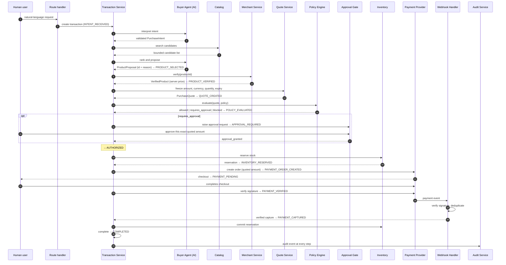

# 04 — Transaction flow

The intended end-to-end flow. **None of this is implemented in Objective 1** —
this document fixes the sequence, the owner of each step, and where trust
changes hands, so later objectives fill in slots rather than invent structure.

```
Human User → AI Buyer Agent → Validated Structured Intent → Agent-Readable Merchant Catalog
→ Product Decision Engine → Server-Side Product Verification → PurchaseQuote
→ Deterministic Policy Engine → Human Approval when required → Inventory Reservation
→ Razorpay Test Order → Standard Checkout → Server-Side Payment Verification
→ Verified Razorpay Webhook → Transaction State Reconciliation
→ Inventory Commit / Release → Completion → Structured Audit Trail
```



## Stage table

| #   | Stage                        | Owner                                         | Trust boundary crossed                 | Data moving                                                        | Where validation happens                                                                                                                              |
| --- | ---------------------------- | --------------------------------------------- | -------------------------------------- | ------------------------------------------------------------------ | ----------------------------------------------------------------------------------------------------------------------------------------------------- |
| 1   | Request received             | Route handler                                 | Browser → server                       | Raw prompt, user id                                                | Zod schema on the request body; length caps; authenticated user resolved server-side                                                                  |
| 2   | Intent interpretation        | Buyer Agent via AI Provider Adapter           | Server → LLM provider → server         | Prompt out, model response in                                      | Response parsed into `PurchaseIntent` by schema **inside the adapter**; no provider object escapes; failure is an audited rejection, not a retry loop |
| 3   | Catalog search               | Catalog                                       | PostgreSQL → agent context             | Bounded candidate projection                                       | Result count and text length capped; no internal fields exposed                                                                                       |
| 4   | Product decision             | Product Decision Engine                       | LLM → server                           | Proposed `productId` and reason                                    | Deterministic pre-filter and post-filter around the model's ranking; reason length-capped                                                             |
| 5   | Product verification         | Merchant Service                              | Agent claim → source of truth          | `productId` in, `VerifiedProduct` out                              | Price, currency and stock re-read from PostgreSQL. **The agent's claimed price is discarded here.**                                                   |
| 6   | Quote creation               | Quote Service                                 | Verified fact → frozen fact            | `PurchaseQuote`: amount in minor units, currency, quantity, expiry | The amount is computed once, here, from server data. Everything downstream reads it from the quote and from nowhere else.                             |
| 7   | Policy evaluation            | Policy Engine                                 | Frozen fact → authorization            | Quote, stored policy                                               | Pure deterministic rules; unrecognised input defaults to `blocked`                                                                                    |
| 8   | Human approval (conditional) | Approval Gate                                 | Server → human → server                | Quoted amount shown, approver identity                             | Acknowledged amount re-compared to the quote; expiry enforced; only `approval_gate` may grant                                                         |
| 9   | Inventory reservation        | Inventory                                     | Authorization → stock hold             | Reservation with expiry                                            | Stock is held **before** money moves. `AUTHORIZED` has no edge to a payment state, so this cannot be skipped.                                         |
| 10  | Order creation               | Payment Provider Interface → Razorpay Adapter | Server → provider                      | Quoted minor units, currency, receipt                              | Amount passed through unchanged; credentials read from the config boundary; response parsed into a domain shape before use                            |
| 11  | Checkout                     | Browser                                       | Server → browser → provider            | Order id, public key id                                            | Nothing returned from the browser is treated as proof of payment                                                                                      |
| 12  | Payment verification         | Razorpay Adapter                              | Provider → server                      | Signature                                                          | HMAC verified server-side → `PAYMENT_VERIFIED`                                                                                                        |
| 13  | Webhook                      | Webhook Handler                               | Provider → server                      | Event payload                                                      | HMAC verified against raw bytes **before** parsing; duplicate provider event ids ignored → `PAYMENT_CAPTURED`                                         |
| 14  | State reconciliation         | Transaction Service                           | Verified outcome → authoritative state | Transition request + history row                                   | `evaluateTransition` checks the edge and the actor; idempotency key stored; every accepted transition appends to `TransactionStateTransition`         |
| 15  | Inventory commit / release   | Inventory                                     | —                                      | Reservation outcome                                                | Committed on completion, released on any terminal failure                                                                                             |
| 16  | Completion                   | Transaction Service                           | —                                      | Final state                                                        | Only reachable from `PAYMENT_CAPTURED`, only by `transaction_service`                                                                                 |
| 17  | Audit                        | Audit Service                                 | Internal → user-visible record         | Append-only events                                                 | Redaction applied; no secrets, no chain-of-thought                                                                                                    |

## Failure paths

Failure is a first-class outcome, not an exception that falls through:

- **Verification failure** (product gone, price changed, out of stock) →
  `BLOCKED`, with a decision record naming the mismatch.
- **Quote expiry** → `EXPIRED`. A stale price is never charged; the flow
  restarts from verification.
- **Policy denial** → `BLOCKED`, with the rule id that denied it.
- **Approval denied or expired** → `BLOCKED` or `EXPIRED`.
- **Stock unavailable at reservation** → `BLOCKED` _before_ any money moves.
- **Order creation or payment failure** → `PAYMENT_FAILED`, which is
  recoverable: the Transaction Service may start a fresh attempt against the
  _same authorization and the same reservation_, without re-entering the AI path
  and without re-deriving the amount. Recoverable is not automatic — a retry is
  granted only to an explicit human request, at most `MAX_PAYMENT_ATTEMPTS`
  times counted from persisted attempt rows, and only after the quote, the
  policy, the approval binding and the stock hold have all been re-checked
  against current facts. Each retry is a **new** `PaymentAttempt` with its own
  provider order; the failed one is never edited. See
  [27 — Payment retry](./27-payment-retry.md).
- **Reservation expiry** → `EXPIRED`, and the hold is released.
- **Unverifiable webhook** → refused before the body is parsed, with no state
  change and no database write of any kind. It is recorded in the operational
  log rather than the audit trail, and that difference is deliberate: an audit
  event belongs to a transaction, and a caller who cannot produce a valid
  signature has not shown us one. Writing a row anyway would let any stranger on
  the internet grow the audit table by POSTing noise. An _authenticated_ webhook
  that does not match our records is a different case and is audited, as
  `webhook_mismatch`.

Every terminal failure that leaves an outstanding hold releases it —
`holdsInventory(state)` in the domain names exactly which states carry one.
