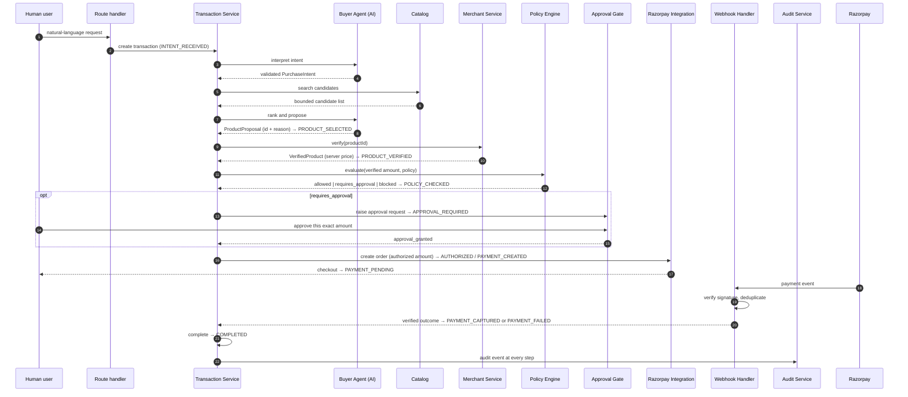

# 04 — Transaction flow

The intended end-to-end flow. **None of this is implemented in Objective 1** —
this document fixes the sequence, the owner of each step, and where trust
changes hands, so later objectives fill in slots rather than invent structure.

## Stage table

| #   | Stage                        | Owner                                  | Trust boundary crossed                 | Data moving                               | Where validation happens                                                                                 |
| --- | ---------------------------- | -------------------------------------- | -------------------------------------- | ----------------------------------------- | -------------------------------------------------------------------------------------------------------- |
| 1   | Request received             | Route handler                          | Browser → server                       | Raw prompt, user id                       | Zod schema on the request body; length caps; authenticated user resolved server-side                     |
| 2   | Intent interpretation        | Buyer Agent                            | Server → LLM provider → server         | Prompt out, model response in             | Model response parsed into `PurchaseIntent` by schema; failure is an audited rejection, not a retry loop |
| 3   | Catalog search               | Catalog                                | Datastore → agent context              | Bounded candidate projection              | Result count and text length capped; no internal fields exposed                                          |
| 4   | Product decision             | Product Decision Engine                | LLM → server                           | Proposed `productId` and reason           | Deterministic pre-filter and post-filter around the model's ranking; reason length-capped                |
| 5   | Product verification         | Merchant Service                       | Agent claim → source of truth          | `productId` in, `VerifiedProduct` out     | Price, currency and stock re-read from the datastore. **The agent's claimed price is discarded here.**   |
| 6   | Policy evaluation            | Policy Engine                          | Verified fact → authorization          | Verified `Money`, stored policy           | Pure deterministic rules; unrecognised input defaults to `blocked`                                       |
| 7   | Human approval (conditional) | Approval Gate                          | Server → human → server                | Amount shown, approver identity           | Approved amount re-compared to the verified amount; expiry enforced; only `approval_gate` may grant      |
| 8   | Order creation               | Razorpay Integration                   | Server → Razorpay                      | Authorized minor units, currency, receipt | Amount passed through unchanged; credentials read from the config boundary; response parsed before use   |
| 9   | Checkout                     | Browser                                | Server → browser → Razorpay            | Order id, public key id                   | Nothing returned from the browser is treated as proof of payment                                         |
| 10  | Payment verification         | Razorpay Integration / Webhook Handler | Razorpay → server                      | Signature, event payload                  | HMAC verified against raw bytes **before** parsing; duplicate provider event ids ignored                 |
| 11  | State update                 | Transaction Service                    | Verified outcome → authoritative state | Transition request                        | `evaluateTransition` checks the edge and the actor; idempotency key stored                               |
| 12  | Completion                   | Transaction Service                    | —                                      | Final state                               | Only reachable from `PAYMENT_CAPTURED`, only by `transaction_service`                                    |
| 13  | Audit                        | Audit Service                          | Internal → user-visible record         | Append-only events                        | Redaction applied; no secrets, no chain-of-thought                                                       |

## Failure paths

The flow is designed so failure is a first-class outcome, not an exception that
falls through:

- **Verification failure** (product gone, price changed, out of stock) →
  `BLOCKED`, with a decision record naming the mismatch.
- **Policy denial** → `BLOCKED`, with the rule id that denied it.
- **Approval denied or expired** → `BLOCKED` or `CANCELLED`.
- **Order creation or payment failure** → `PAYMENT_FAILED`, which is
  recoverable: the Transaction Service may start a fresh attempt against the
  _same existing authorization_, without re-entering the AI path.
- **Unverifiable webhook** → rejected and audited as `webhook_rejected`; no
  state change occurs.
