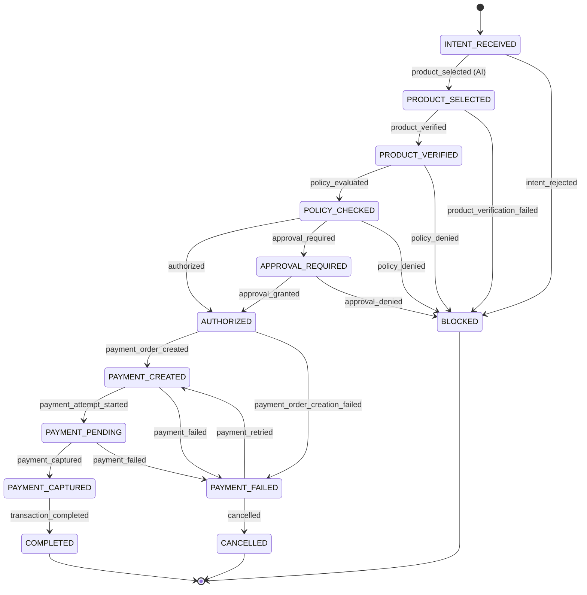

# 05 — Transaction state machine

**Implemented.** See
[`states.ts`](../src/domain/transaction/states.ts),
[`transitions.ts`](../src/domain/transaction/transitions.ts),
[`state-machine.ts`](../src/domain/transaction/state-machine.ts), and
[`tests/transaction-state-machine.test.ts`](../tests/transaction-state-machine.test.ts).

## Why this is the centre of the design

Every other financial control can be argued about. This one is checkable. The
transition table is data: a `(from, to)` pair with a list of actors permitted to
make that move. "AI cannot approve itself" and "AI cannot mark a payment
successful" are therefore not comments — they are the absence of an actor from a
list, and a test fails if that changes.

## States

| State               | Meaning                                                            | Kind                      |
| ------------------- | ------------------------------------------------------------------ | ------------------------- |
| `INTENT_RECEIVED`   | A structured purchase intent has been accepted.                    | initial                   |
| `PRODUCT_SELECTED`  | The agent proposed a product. A proposal only.                     | active                    |
| `PRODUCT_VERIFIED`  | Price, currency and stock re-read from the source of truth.        | active                    |
| `POLICY_CHECKED`    | The deterministic policy engine has evaluated the verified amount. | active                    |
| `APPROVAL_REQUIRED` | Policy requires a human decision before money moves.               | active                    |
| `AUTHORIZED`        | A final authorization exists for one specific amount.              | active                    |
| `PAYMENT_CREATED`   | A Razorpay order exists for the authorized amount.                 | active                    |
| `PAYMENT_PENDING`   | Checkout handed to the user; awaiting a verified outcome.          | active                    |
| `PAYMENT_CAPTURED`  | A verified capture has been observed.                              | active                    |
| `COMPLETED`         | Finished successfully and fully audited.                           | **terminal**              |
| `PAYMENT_FAILED`    | An attempt failed. Recoverable.                                    | **failure**, not terminal |
| `BLOCKED`           | A deterministic control refused the transaction.                   | **terminal**, **failure** |
| `CANCELLED`         | Abandoned before completion.                                       | **terminal**              |

### One refinement to the candidate model

The candidate state list was adopted as given, with a single deliberate change:
`PAYMENT_FAILED` is a **failure state but not a terminal state**.

The reasoning: a failed payment attempt is an expected outcome the demo must
handle gracefully, and the correct recovery is a fresh attempt against the
authorization that already exists. Making it terminal would force a retry to
restart the whole flow — re-running the LLM, re-selecting a product, and
re-deciding an amount that had already been approved. Separating "failure" from
"terminal" keeps the retry inside the deterministic half of the system.
`PAYMENT_CREATED` and `PAYMENT_PENDING` were also kept distinct: the first means
an order exists server-side, the second means the user has been handed checkout
and an external outcome is now pending.

## Transition graph

Cancellation edges from `INTENT_RECEIVED`, `PRODUCT_SELECTED`,
`PRODUCT_VERIFIED`, `POLICY_CHECKED`, `APPROVAL_REQUIRED` and `AUTHORIZED` are
omitted from the diagram for readability; they exist in the table and are open
to `human_user` and `transaction_service`.

## Who may trigger what

| Transition                                                       | Permitted actors                                                                        |
| ---------------------------------------------------------------- | --------------------------------------------------------------------------------------- |
| `INTENT_RECEIVED -> PRODUCT_SELECTED`                            | `buyer_agent`, `product_decision_engine` — **the only AI-permitted edge in the system** |
| `PRODUCT_SELECTED -> PRODUCT_VERIFIED`                           | `merchant_service`                                                                      |
| `PRODUCT_VERIFIED -> POLICY_CHECKED`                             | `policy_engine`                                                                         |
| `POLICY_CHECKED -> AUTHORIZED` / `APPROVAL_REQUIRED` / `BLOCKED` | `policy_engine`                                                                         |
| `APPROVAL_REQUIRED -> AUTHORIZED` / `BLOCKED`                    | `approval_gate`                                                                         |
| `AUTHORIZED -> PAYMENT_CREATED`                                  | `razorpay_integration`                                                                  |
| `PAYMENT_CREATED -> PAYMENT_PENDING`                             | `razorpay_integration`, `transaction_service`                                           |
| `PAYMENT_PENDING -> PAYMENT_CAPTURED` / `PAYMENT_FAILED`         | `razorpay_webhook`, `razorpay_integration`                                              |
| `PAYMENT_CAPTURED -> COMPLETED`                                  | `transaction_service`                                                                   |
| `PAYMENT_FAILED -> PAYMENT_CREATED`                              | `transaction_service`                                                                   |
| any `-> CANCELLED`                                               | `human_user`, `transaction_service`                                                     |

## Invalid transitions

Anything not in the table is rejected with a typed reason:

| Rejection reason      | Example                                                                           |
| --------------------- | --------------------------------------------------------------------------------- |
| `unknown_transition`  | `PRODUCT_SELECTED -> AUTHORIZED` (skips verification and policy)                  |
| `unknown_transition`  | `POLICY_CHECKED -> PAYMENT_CAPTURED` (skips authorization and the payment itself) |
| `actor_not_permitted` | `buyer_agent` attempting `APPROVAL_REQUIRED -> AUTHORIZED`                        |
| `actor_not_permitted` | `buyer_agent` attempting `PAYMENT_PENDING -> PAYMENT_CAPTURED`                    |
| `terminal_state`      | any move out of `COMPLETED`, `BLOCKED` or `CANCELLED`                             |

Rejections are returned as values (`Result`), not thrown, because a refusal is
an auditable business outcome: the `explanation` field feeds straight into a
decision record. `assertTransition` is the throwing variant, for call sites
where a rejection would mean a bug.

## Idempotency

`TransitionRequest` carries an optional `IdempotencyKey`. Webhooks arrive at
least once and out of order, so:

- A request whose `from` equals `to`, where `to` is a state some transition can
  legitimately reach, resolves to `outcome: "already_applied"` — a success, not
  an error. A replayed `payment.captured` therefore does not fail the caller.
- The persistence layer (Objective: transactions) stores the idempotency key
  alongside the transition, so a replay is recognised before a second write is
  attempted. **The store is the enforcement point; the state machine only makes
  replay expressible.**
- The webhook handler additionally deduplicates on the provider's own event id
  before it ever reaches the state machine.
