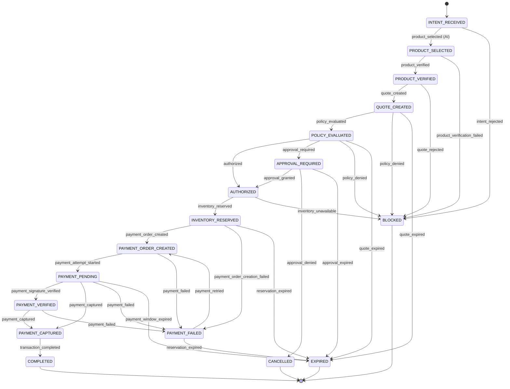

# 05 — Transaction state machine

**Design.** The working engine - domain events, the transition service,
atomicity, concurrency and idempotency - is documented in
[17 — State machine engine](./17-transaction-state-machine.md).

Implemented in:
[`states.ts`](../src/domain/transaction/states.ts),
[`transitions.ts`](../src/domain/transaction/transitions.ts),
[`state-machine.ts`](../src/domain/transaction/state-machine.ts), and
[`tests/transaction-state-machine.test.ts`](../tests/transaction-state-machine.test.ts).

`states.ts` is the **single authoritative definition** of transaction states.
No competing enum may exist anywhere — including the Prisma schema in Objective
2, which must match this list rather than declare its own.

## Why this is the centre of the design

Every other financial control can be argued about. This one is checkable. The
transition table is data: a `(from, to)` pair with a list of actors permitted to
make that move. "AI cannot approve itself" and "AI cannot mark a payment
successful" are therefore not comments — they are the absence of an actor from a
list, and a test fails if that changes.

## States

| State                   | Meaning                                                               | Kind                                   |
| ----------------------- | --------------------------------------------------------------------- | -------------------------------------- |
| `INTENT_RECEIVED`       | A structured purchase intent has been accepted.                       | initial                                |
| `PRODUCT_SELECTED`      | The agent proposed a product. A proposal only.                        | active                                 |
| `PRODUCT_VERIFIED`      | Price, currency and stock re-read from the source of truth.           | active                                 |
| `QUOTE_CREATED`         | A `PurchaseQuote` froze the amount, currency, quantity and an expiry. | active                                 |
| `POLICY_EVALUATED`      | The deterministic policy engine has evaluated the quoted amount.      | active                                 |
| `APPROVAL_REQUIRED`     | Policy requires a human decision before money moves.                  | active                                 |
| `AUTHORIZED`            | A final authorization exists for one specific quoted amount.          | active                                 |
| `INVENTORY_RESERVED`    | Stock is held for this transaction.                                   | active, holds stock                    |
| `PAYMENT_ORDER_CREATED` | A provider order exists for the authorized amount.                    | active, holds stock                    |
| `PAYMENT_PENDING`       | Checkout handed to the user; awaiting a verified outcome.             | active, holds stock                    |
| `PAYMENT_VERIFIED`      | A payment signature was verified server-side. Not yet settled.        | active, holds stock                    |
| `PAYMENT_CAPTURED`      | A verified capture has been observed from the provider.               | active, holds stock                    |
| `COMPLETED`             | Finished successfully, inventory committed, fully audited.            | **terminal**                           |
| `PAYMENT_FAILED`        | An attempt failed. Recoverable.                                       | **failure**, not terminal, holds stock |
| `BLOCKED`               | A deterministic control refused the transaction.                      | **terminal**, **failure**              |
| `CANCELLED`             | Abandoned before completion.                                          | **terminal**                           |
| `EXPIRED`               | A quote, approval, reservation or payment window elapsed.             | **terminal**, **failure**              |

### Design notes on the model

- **`PAYMENT_FAILED` is a failure state but not a terminal state.** A failed
  attempt is expected, and the correct recovery is a fresh attempt against the
  authorization and reservation that already exist. Making it terminal would
  force a retry to restart the whole flow — re-running the LLM, re-selecting a
  product, and re-deriving an amount that had already been approved.
- **`PAYMENT_VERIFIED` and `PAYMENT_CAPTURED` are distinct.** Verification is
  the server checking the checkout signature; capture is the provider confirming
  settlement, normally via webhook. Collapsing them would mean trusting a
  browser round-trip as proof of settlement.
- **Both are reachable independently.** A verified webhook can report a capture
  without the checkout callback ever arriving, so `PAYMENT_PENDING` has an edge
  straight to `PAYMENT_CAPTURED`.
- **`EXPIRED` is separate from `CANCELLED`.** Cancellation is a decision;
  expiry is a clock. Only `system` and `transaction_service` may trigger it — a
  test asserts that no user and no agent can expire a transaction.
- **Actor names are vendor-neutral.** `payment_provider`, not `razorpay`. The
  domain core must not name a vendor; a test asserts no actor matches a payment
  brand.

## Transition graph

Cancellation edges are omitted from the diagram for readability; they exist in
the table from every non-terminal state except `PAYMENT_PENDING` and
`PAYMENT_VERIFIED` (where an external payment is already in flight), and are
open to `human_user` and `transaction_service`.

## Who may trigger what

| Transition                                                        | Permitted actors                                                                        |
| ----------------------------------------------------------------- | --------------------------------------------------------------------------------------- |
| `INTENT_RECEIVED → PRODUCT_SELECTED`                              | `buyer_agent`, `product_decision_engine` — **the only AI-permitted edge in the system** |
| `PRODUCT_SELECTED → PRODUCT_VERIFIED`                             | `merchant_service`                                                                      |
| `PRODUCT_VERIFIED → QUOTE_CREATED`                                | `quote_service`                                                                         |
| `QUOTE_CREATED → POLICY_EVALUATED`                                | `policy_engine`                                                                         |
| `POLICY_EVALUATED → AUTHORIZED` / `APPROVAL_REQUIRED` / `BLOCKED` | `policy_engine`                                                                         |
| `APPROVAL_REQUIRED → AUTHORIZED` / `BLOCKED`                      | `approval_gate`                                                                         |
| `AUTHORIZED → INVENTORY_RESERVED`                                 | `inventory_service`                                                                     |
| `INVENTORY_RESERVED → PAYMENT_ORDER_CREATED`                      | `payment_provider`                                                                      |
| `PAYMENT_ORDER_CREATED → PAYMENT_PENDING`                         | `payment_provider`, `transaction_service`                                               |
| `PAYMENT_PENDING → PAYMENT_VERIFIED`                              | `payment_provider`                                                                      |
| `PAYMENT_PENDING` / `PAYMENT_VERIFIED → PAYMENT_CAPTURED`         | `payment_webhook`, `payment_provider`                                                   |
| `PAYMENT_CAPTURED → COMPLETED`                                    | `transaction_service`                                                                   |
| `PAYMENT_FAILED → PAYMENT_ORDER_CREATED`                          | `transaction_service`                                                                   |
| any `→ EXPIRED`                                                   | `system`, `transaction_service`                                                         |
| any `→ CANCELLED`                                                 | `human_user`, `transaction_service`                                                     |

## Invalid transitions

Anything not in the table is rejected with a typed reason:

| Rejection reason      | Example                                                                                                                                                                                                                                                                                                                        |
| --------------------- | ------------------------------------------------------------------------------------------------------------------------------------------------------------------------------------------------------------------------------------------------------------------------------------------------------------------------------ |
| `unknown_transition`  | `PRODUCT_SELECTED → AUTHORIZED` (skips verification, quote and policy)                                                                                                                                                                                                                                                         |
| `unknown_transition`  | `PRODUCT_VERIFIED → POLICY_EVALUATED` (skips the quote, so policy would judge an unfrozen amount)                                                                                                                                                                                                                              |
| `unknown_transition`  | `AUTHORIZED → PAYMENT_ORDER_CREATED` **for an ordinary first payment** (skips the reservation — the check-then-charge race). One narrow, later-added exception exists for a controlled retry rebinding stock already held before the first attempt — see [27](./27-payment-retry.md); it is not a second way to skip the hold. |
| `unknown_transition`  | `POLICY_EVALUATED → PAYMENT_CAPTURED` (skips authorization and the payment itself)                                                                                                                                                                                                                                             |
| `actor_not_permitted` | `buyer_agent` attempting `APPROVAL_REQUIRED → AUTHORIZED`                                                                                                                                                                                                                                                                      |
| `actor_not_permitted` | `buyer_agent` attempting `PAYMENT_VERIFIED → PAYMENT_CAPTURED`                                                                                                                                                                                                                                                                 |
| `terminal_state`      | any move out of `COMPLETED`, `BLOCKED`, `CANCELLED` or `EXPIRED`                                                                                                                                                                                                                                                               |

Rejections are returned as values (a `TransitionDecision`), not thrown, because
a refusal is an auditable business outcome. The implemented engine's return
shape and its throwing/typed-error behaviour at the service boundary are
documented in [17](./17-transaction-state-machine.md#errors) — there is no
separate "assert" variant; every caller is expected to inspect the decision.

## Transition history

Persisting only `Transaction.currentState` cannot answer "how did this
transaction get here". Every **accepted** transition therefore appends a
`TransactionStateTransition` row: transaction id, previous state, next state,
actor, reason, timestamp. Append-only, never updated.

Rejected transitions are _not_ history — they are audit events, since they never
happened. Objective 2 models the table; Objective 3 writes it.

## Inventory holds

`holdsInventory(state)` names every state in which stock is reserved:
`INVENTORY_RESERVED` through `PAYMENT_CAPTURED`, plus `PAYMENT_FAILED` (so a
retry does not lose the hold). Any exit from one of these toward a terminal
failure state must release the reservation; reaching `COMPLETED` commits it.

## Idempotency

`TransitionRequest` carries an optional `IdempotencyKey`. Webhooks arrive at
least once and out of order, so:

- A request whose `from` equals `to`, where `to` is a state some transition can
  legitimately reach, resolves to `outcome: "already_applied"` — a success, not
  an error. A replayed `payment.captured` therefore does not fail the caller.
- The persistence layer stores the idempotency key alongside the transition, so
  a replay is recognised before a second write is attempted. **The store is the
  enforcement point; the state machine only makes replay expressible.**
- The webhook handler additionally deduplicates on the provider's own event id
  before it ever reaches the state machine.
