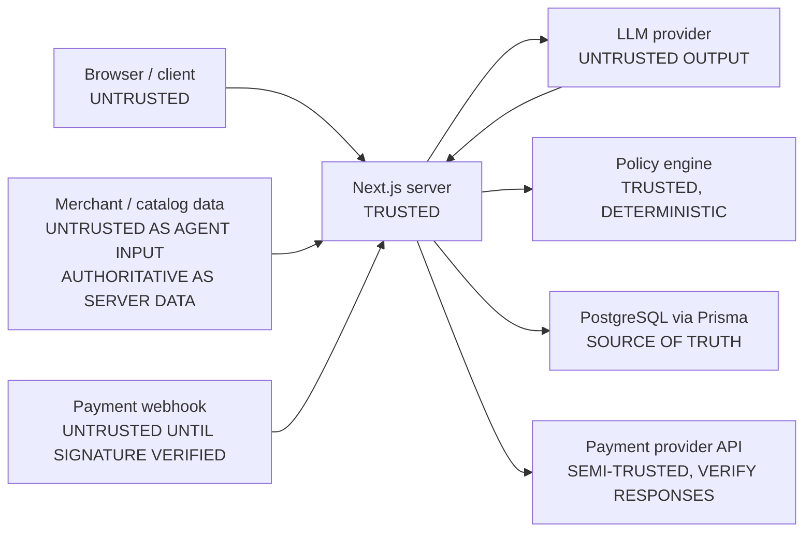

# 06 — Security and trust boundaries

## Three trust levels

Every input in the system sits in exactly one of these.

### UNTRUSTED — never acted on as-is

- the browser / client, and all user-controlled request data
- **LLM output**, every token of it
- merchant and product description text (it reaches a model, so it is an
  injection vector even though the row it came from is authoritative for price)
- external webhook payloads, **before** signature verification

### TRUSTED ONLY AFTER VALIDATION

- structured AI output, once parsed by a schema inside the AI Provider Adapter
- webhook data, once its HMAC is verified against the raw bytes
- API requests, once validated against their Zod schema and bound to an
  authenticated user

### AUTHORITATIVE — the source of truth

- the server-side PostgreSQL database
- the deterministic policy engine
- the transaction state machine
- verified payment provider state

The whole architecture is the discipline of never letting something in the first
group be treated as though it were in the third.

## The trust model

## Zone by zone

| Zone                        | Trust                                   | Convention                                                                                                                                                                                                                      |
| --------------------------- | --------------------------------------- | ------------------------------------------------------------------------------------------------------------------------------------------------------------------------------------------------------------------------------- |
| **Browser / client**        | Untrusted (invariant 1)                 | Every request body is schema-validated server-side. The identity of the user is resolved from the session, never from the payload. No amount, price, or state is ever accepted from the client.                                 |
| **Next.js server**          | Trusted                                 | The only place secrets exist. All authoritative decisions happen here.                                                                                                                                                          |
| **LLM provider**            | Output untrusted (invariant 2)          | Responses are parsed by a schema before being read. Text fields are length-capped. A malformed response is an audited rejection, not a retry-until-it-parses loop.                                                              |
| **Merchant / catalog data** | Dual (invariant 3)                      | As _server data_ it is the price and stock source of truth. As _agent input_ — titles, descriptions, attributes — it is untrusted text that may carry prompt injection, so it never carries instructions and never sets policy. |
| **Policy engine**           | Trusted, deterministic (invariant 6)    | Pure functions over verified facts and stored policy. Not reachable from any agent tool surface. Unrecognised input defaults to `blocked`.                                                                                      |
| **Database**                | Source of truth                         | Prices, inventory, policies, transaction state and audit all resolve here. Written only by the service that owns each entity.                                                                                                   |
| **Razorpay API**            | Semi-trusted                            | Credentials are ours, but responses are still parsed and validated before use. Provider objects never flow into the domain.                                                                                                     |
| **Razorpay webhook input**  | Untrusted until verified (invariant 10) | Verify the HMAC against the raw request bytes _before_ parsing, then deduplicate on the provider event id, then act.                                                                                                            |

## Browser-facing hardening (Objective 15)

### Response headers

Declared once in `next.config.ts` and applied to every route.

| Header                      | Why                                                                                                                                       |
| --------------------------- | ----------------------------------------------------------------------------------------------------------------------------------------- |
| `Content-Security-Policy`   | No script may load from a host that is not listed; `object-src 'none'`, `base-uri 'self'`, `form-action 'self'`, `frame-ancestors 'none'` |
| `X-Content-Type-Options`    | A JSON error body must never be sniffed into script                                                                                       |
| `Referrer-Policy`           | Transaction ids live in URLs and must not leak to third parties                                                                           |
| `Permissions-Policy`        | Camera, microphone, geolocation and USB are denied outright                                                                               |
| `X-Frame-Options`           | Agrees with `frame-ancestors`, for browsers honouring only this one                                                                       |
| `Strict-Transport-Security` | Sent only when `APP_URL` is HTTPS, per RFC 6797                                                                                           |

The CSP lists the Razorpay origins Checkout needs — the script host, the payment
frame, its XHR and telemetry hosts, its images and fonts. A policy missing any
of these does not fail loudly; it fails as a buyer pressing Pay and nothing
happening, which is why the allowances are asserted by test.

**Known limitation, stated rather than hidden:** `script-src` still allows
`'unsafe-inline'`. Next.js App Router inlines its streaming payload as script
tags, and this project prerenders pages at build time; a nonce must be generated
per request, so adopting one means making every page dynamically rendered. That
is a rendering-behaviour decision, deliberately deferred. The CSP therefore does
not by itself stop an injected inline script — it stops loading from unlisted
hosts, framing, base-tag rewriting and off-site form posts.

### Cross-site abuse of state-changing endpoints

There are no cookies, no session and no login, so there is no classical CSRF
exposure — nothing ambient for another site to ride on. Adding a CSRF token
would be ceremony aimed at a threat that is not there.

What is real: the state-changing endpoints are unauthenticated, so anyone who
learns a transaction id can host a page that posts to `/api/payments/retry` or
`/api/payments/order` from a visitor's browser. The server-side gates still hold
— the amount comes from the persisted quote, the attempt limit is counted from
rows, policy and approval are re-run — so the damage is bounded. Bounded is not
intended.

`src/lib/http/same-origin.ts` checks `Sec-Fetch-Site` first (a browser sets it;
page script cannot), falling back to `Origin` compared against `APP_URL`. It is
called from `readBody` in the payments boundary, so every state-changing payment
route is covered by construction rather than by remembering, and from the buyer
agent handler, where the cost of abuse is model quota.

A request carrying neither header is allowed: it is not a browser, and this is a
browser-driven attack. `curl` and server-to-server callers cannot be aimed at a
victim's browser, and an attacker who controls the client controls these headers
anyway. The value of the check is entirely that it constrains real browsers.

The **webhook** is deliberately exempt. It is machine-to-machine, carries no
browser headers, and its authenticity comes from an HMAC over the raw body —
a far stronger claim than any origin header.

## Conventions

### Secrets

Server-only, always. `RAZORPAY_KEY_SECRET`, `RAZORPAY_WEBHOOK_SECRET`,
`GEMINI_API_KEY`, `APP_SECRET`, `DATABASE_URL` and `DIRECT_URL` are read only through
[`src/config/env.ts`](../src/config/env.ts), only inside the adapter that needs
them. No secret is ever prefixed `NEXT_PUBLIC_`. Configuration errors report
variable **names**, never values — enforced by a test. Redaction (below) is the
second line of defence if one is ever passed into metadata by accident.

### Input validation

Two layers, both required:

1. **Structural** — a Zod schema at every boundary: request bodies, LLM
   responses, webhook payloads, provider responses.
2. **Semantic** — after structure, the domain re-derives facts rather than
   trusting asserted ones. A valid-looking `productId` still gets resolved
   server-side.

### Untrusted LLM output

Treated as a _proposal_, always. It may name a product; it may not name a price,
a policy, an authorization, or a state. Its explanation text is capped at 400
characters, which structurally prevents reasoning being dumped into an audited
field.

### Untrusted client input

The browser may start a flow, approve an amount it was shown, and read its own
transactions. It may never supply an amount, a price, a product's authoritative
data, a policy, a state, or another user's identifier.

### Authoritative price and amount

Read from PostgreSQL at verification time, frozen once into a `PurchaseQuote`,
and carried as `Money` (integer minor units + explicit currency) through to the
payment order without a conversion step. The quote is the only place the payable
amount exists.

| Concern              | Authoritative source                                       |
| -------------------- | ---------------------------------------------------------- |
| Price                | Server / PostgreSQL only                                   |
| Inventory            | Server / PostgreSQL only                                   |
| Currency             | Server / PostgreSQL only                                   |
| Authorization policy | Server / PostgreSQL + deterministic policy layer only      |
| Transaction state    | Server-side state machine only                             |
| Payment status       | Verified server-side payment data or verified webhook only |

### Authoritative authorization

Produced only by the policy engine, and only for one specific verified amount.
An authorization does not survive a change in that amount: if verification is
re-run and the price moved, the previous authorization is void.

### Webhook verification

Fixed order: raw bytes → HMAC verification → parse → dedupe on provider event id
→ act. Duplicates return a success status so the provider stops retrying.
_The exact header name and signature algorithm are to be verified during the
Razorpay integration objective._

### Idempotency

Two independent layers: the provider event id (webhook table, unique index) and
the transition idempotency key (transaction store). Either alone would leave a
gap; together, a replayed event cannot produce a second state change.

### Preventing agent bypass of financial controls

Five independent barriers, so no single mistake is sufficient:

1. The agent's tool surface exposes **search and propose only** — no payment
   tool, no policy tool, no state-mutation tool exists for it to call.
2. Amounts are never parameters the agent can supply; they are re-derived from
   the datastore.
3. The transition table gives AI actors exactly one edge, checked on every
   write.
4. Route handlers hold no business logic, so there is no endpoint an agent could
   reach that shortcuts a service.
5. The payable amount exists in exactly one place — the `PurchaseQuote` — so
   there is no second code path where a different amount could be introduced.

## Not implemented in Objective 1

Authentication and session management, rate limiting, CSRF handling, database
access control, and the signature verification itself. This document fixes the
conventions those implementations must satisfy.
