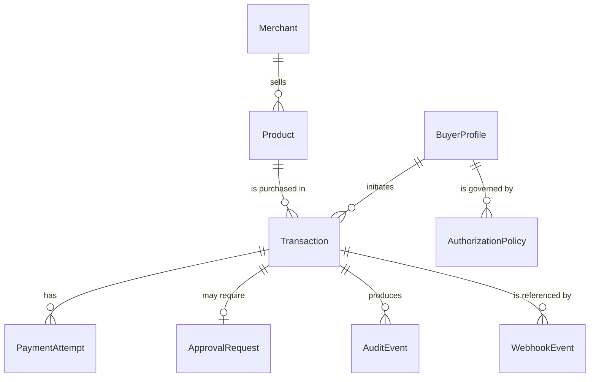

# 08 — Data model design

**Design only.** No schema, ORM or migration exists in Objective 1 — the
foundation needs no datastore to boot, and choosing one early would lock in a
dependency before the first feature justifies it. This document locks the
_shape_, so the eventual schema is a transcription rather than a redesign.

## Money, everywhere, without exception

Every monetary field is stored as **two columns**:

```
<name>MinorUnits   integer   -- ₹299.00 is 29900
<name>Currency     text      -- ISO 4217, e.g. "INR"
```

Never a decimal, float, or numeric-with-scale column. Never an amount without
its currency beside it. The application type is
[`Money`](../src/domain/money.ts), which enforces the integer constraint at
construction and refuses to combine mismatched currencies.

This is also what Razorpay's API expects, so the authoritative price reaches the
payment provider with no conversion step in which a rounding error could live.

## Entities



### BuyerProfile

|               |                                                                                                                |
| ------------- | -------------------------------------------------------------------------------------------------------------- |
| Purpose       | The human on whose behalf the agent acts.                                                                      |
| Primary id    | `userId`                                                                                                       |
| Fields        | `displayName`, `email`, `defaultPolicyId`, `createdAt`, `updatedAt`                                            |
| Relationships | Has many transactions; has one active authorization policy.                                                    |
| Status enum   | `active` \| `suspended`                                                                                        |
| Privacy       | Email is personal data: never written to a log or an audit detail field. Audit events reference `userId` only. |

### Merchant

|               |                                                                  |
| ------------- | ---------------------------------------------------------------- |
| Purpose       | The selling entity a transaction is against.                     |
| Primary id    | `merchantId`                                                     |
| Fields        | `name`, `razorpayAccountRef`, `createdAt`, `updatedAt`           |
| Relationships | Has many products.                                               |
| Status enum   | `active` \| `inactive`                                           |
| Security      | `razorpayAccountRef` is an opaque reference, never a credential. |

### Product

|               |                                                                                                                                                                                                                           |
| ------------- | ------------------------------------------------------------------------------------------------------------------------------------------------------------------------------------------------------------------------- |
| Purpose       | **The authoritative price and inventory record.** Invariants 4 and 5.                                                                                                                                                     |
| Primary id    | `productId`                                                                                                                                                                                                               |
| Fields        | `merchantId`, `title`, `description`, `category`, `attributes` (structured), `priceMinorUnits`, `priceCurrency`, `stockQuantity`, `createdAt`, `updatedAt`                                                                |
| Relationships | Belongs to a merchant.                                                                                                                                                                                                    |
| Status enum   | `available` \| `out_of_stock` \| `discontinued`                                                                                                                                                                           |
| Security      | `title` and `description` are shown to the model and are therefore _untrusted text_ in that context, even though the row itself is authoritative for price. Price is only ever read here, never written by an agent path. |

### AuthorizationPolicy

|               |                                                                                                                                                                                                                                                                   |
| ------------- | ----------------------------------------------------------------------------------------------------------------------------------------------------------------------------------------------------------------------------------------------------------------- |
| Purpose       | The deterministic rules the policy engine evaluates.                                                                                                                                                                                                              |
| Primary id    | `policyId`                                                                                                                                                                                                                                                        |
| Fields        | `userId`, `maxTransactionMinorUnits`, `maxTransactionCurrency`, `approvalThresholdMinorUnits`, `allowedCategories`, `blockedCategories`, `dailyLimitMinorUnits`, `version`, `createdAt`, `updatedAt`                                                              |
| Relationships | Belongs to a buyer.                                                                                                                                                                                                                                               |
| Status enum   | `active` \| `superseded`                                                                                                                                                                                                                                          |
| Security      | Writable only by a human-authenticated administrative path. **No agent path may write it** — invariant "AI cannot modify authorization policies". Versioned rather than mutated, so an old decision can be re-explained against the policy that actually applied. |

### Transaction

|               |                                                                                                                                                                                                                                                                                                      |
| ------------- | ---------------------------------------------------------------------------------------------------------------------------------------------------------------------------------------------------------------------------------------------------------------------------------------------------- |
| Purpose       | The authoritative record of one purchase attempt and its state.                                                                                                                                                                                                                                      |
| Primary id    | `transactionId`                                                                                                                                                                                                                                                                                      |
| Fields        | `userId`, `merchantId`, `productId` (nullable until selected), `intent` (structured), `verifiedAmountMinorUnits`, `verifiedAmountCurrency`, `authorizedAmountMinorUnits`, `authorizedAmountCurrency`, `policyId`, `policyVersion`, `state`, `correlationId`, `createdAt`, `updatedAt`, `completedAt` |
| Relationships | Has many payment attempts, audit events; may have one approval request.                                                                                                                                                                                                                              |
| Status enum   | `TransactionState` — the 13 states in [05](./05-transaction-state-machine.md).                                                                                                                                                                                                                       |
| Security      | `state` is written only by the Transaction Service, only via `evaluateTransition`. Verified and authorized amounts are kept as separate fields on purpose: if a re-verification disagrees with the authorized amount, that discrepancy is visible rather than silently overwritten.                  |

### PaymentAttempt

|               |                                                                                                                                                                                      |
| ------------- | ------------------------------------------------------------------------------------------------------------------------------------------------------------------------------------ |
| Purpose       | One attempt to move money. A transaction may have several.                                                                                                                           |
| Primary id    | `paymentAttemptId`                                                                                                                                                                   |
| Fields        | `transactionId`, `razorpayOrderId`, `razorpayPaymentId`, `amountMinorUnits`, `amountCurrency`, `status`, `failureCode`, `failureReason`, `idempotencyKey`, `createdAt`, `updatedAt`  |
| Relationships | Belongs to a transaction.                                                                                                                                                            |
| Status enum   | `created` \| `pending` \| `captured` \| `failed`                                                                                                                                     |
| Security      | Stores provider **references only** — no card number, no UPI handle, no CVV, no raw provider payload. `failureReason` is a mapped, safe string, not the provider's verbatim message. |

### ApprovalRequest

|               |                                                                                                                                                                        |
| ------------- | ---------------------------------------------------------------------------------------------------------------------------------------------------------------------- |
| Purpose       | A human decision on one specific amount.                                                                                                                               |
| Primary id    | `approvalRequestId`                                                                                                                                                    |
| Fields        | `transactionId`, `requestedAmountMinorUnits`, `requestedAmountCurrency`, `reason`, `requiredByRule`, `status`, `approverUserId`, `decidedAt`, `expiresAt`, `createdAt` |
| Relationships | Belongs to a transaction.                                                                                                                                              |
| Status enum   | `pending` \| `approved` \| `denied` \| `expired`                                                                                                                       |
| Security      | `approverUserId` must be a human account; an agent identity can never occupy it. The amount is frozen at request time and re-compared before authorization stands.     |

### AuditEvent

|               |                                                                                                                                 |
| ------------- | ------------------------------------------------------------------------------------------------------------------------------- |
| Purpose       | The append-only, user-facing record. See [11](./11-explainability-and-audit.md).                                                |
| Primary id    | `eventId`                                                                                                                       |
| Fields        | `transactionId`, `eventType`, `actor`, `result`, `details` (structured JSON), `decisionId`, `correlationId`, `occurredAt`       |
| Relationships | Belongs to a transaction; may reference a decision record.                                                                      |
| Status enum   | `result`: `success` \| `failure` \| `blocked` \| `pending`                                                                      |
| Security      | Append-only: no updates, no deletes. Everything passes redaction. No secrets, no card data, no chain-of-thought (invariant 16). |

### WebhookEvent

|               |                                                                                                                                                                                                            |
| ------------- | ---------------------------------------------------------------------------------------------------------------------------------------------------------------------------------------------------------- |
| Purpose       | The deduplication ledger for inbound provider events.                                                                                                                                                      |
| Primary id    | `webhookEventId`                                                                                                                                                                                           |
| Fields        | `providerEventId` (**unique index**), `provider`, `eventType`, `signatureVerified`, `payloadDigest`, `transactionId` (nullable), `processedAt`, `receivedAt`                                               |
| Relationships | May reference a transaction once resolved.                                                                                                                                                                 |
| Status enum   | `received` \| `verified` \| `rejected` \| `processed` \| `duplicate`                                                                                                                                       |
| Security      | Invariant 11 is enforced by the unique index on `providerEventId`, not by application logic alone. The raw body is **not** stored — only a digest — so a payload cannot become an accidental secret store. |

## Cross-cutting

- **Timestamps**: every entity carries `createdAt`; mutable entities carry
  `updatedAt`. All UTC ISO-8601.
- **Identifiers**: opaque strings, branded in TypeScript
  ([`identifiers.ts`](../src/domain/identifiers.ts)) so a `ProductId` cannot be
  passed where a `TransactionId` belongs.
- **Correlation**: `correlationId` appears on transactions, audit events and log
  lines, so one logical request can be reassembled across all three.
