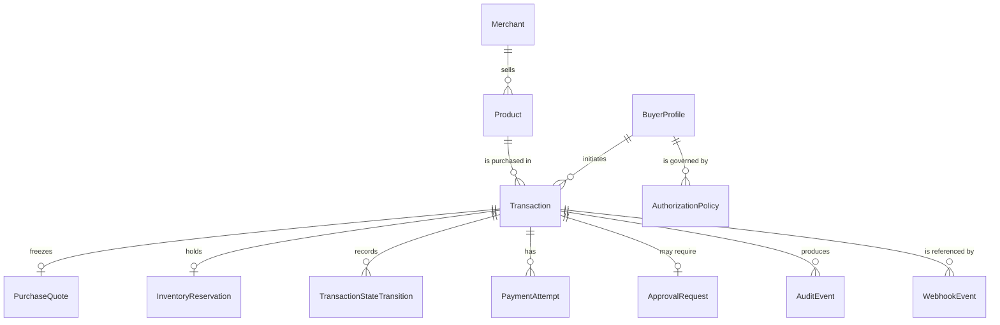

# 08 — Data model design

**Design only.** No schema, model or migration exists in Objective 1. This
document locks the _shape_, so the Objective 2 schema is a transcription rather
than a redesign.

## Locked persistence architecture

| Decision     | Value                                                               |
| ------------ | ------------------------------------------------------------------- |
| Database     | **PostgreSQL**, authoritative for everything                        |
| Data access  | **Prisma ORM**, typed, server-only                                  |
| Hosting      | Prisma Postgres is the planned provider; any PostgreSQL works       |
| Environments | Development and deployment share the **same** database architecture |

There is **no SQLite tier and no planned late migration**. A "SQLite now,
PostgreSQL later" split would mean developing against different transaction,
concurrency and locking semantics than production runs on — and this system
depends on exactly those semantics for the inventory reservation and the
idempotent transition write. The behaviour that must be correct is the behaviour
that has to be exercised in development.

The architecture must support, from Objective 2 onward:

- **Migrations**, versioned in the repository.
- **A pooled runtime connection** (`DATABASE_URL`) for per-request work.
- **A direct migration connection** (`DIRECT_URL`), because connection poolers
  generally cannot run DDL. Optional when the instance is unpooled.
- **Typed database access** — no raw string queries in business code.
- **A server-only database boundary** — `src/integrations/persistence/`. Nothing
  in `app/` or a React component may import it directly.

Objective 2 creates the schema. This patch creates none.

## Money, everywhere, without exception

Every monetary field is stored as **two columns**:

```
<name>MinorUnits   integer   -- ₹299.00 is 29900
<name>Currency     text      -- ISO 4217, e.g. "INR"
```

Never a decimal, float, `numeric`, or `numeric(p,s)` column — in PostgreSQL or
anywhere else. Never an amount without its currency beside it. In Prisma these
are `Int` (or `BigInt` where range demands it) plus a `String` or enum currency.

The application type is [`Money`](../src/domain/money.ts), which enforces the
integer constraint at construction and refuses to combine mismatched currencies.
This is also what Razorpay's API expects, so the authoritative price reaches the
payment provider with no conversion step in which a rounding error could live.

## Entities



### BuyerProfile

|               |                                                                                                                |
| ------------- | -------------------------------------------------------------------------------------------------------------- |
| Purpose       | The human on whose behalf the agent acts.                                                                      |
| Primary id    | `userId`                                                                                                       |
| Fields        | `displayName`, `email`, `defaultPolicyId`, `createdAt`, `updatedAt`                                            |
| Relationships | Has many transactions; has one active authorization policy.                                                    |
| Status enum   | `active` \| `suspended`                                                                                        |
| Privacy       | Email is personal data: never written to a log or an audit detail field. Audit events reference `userId` only. |

### Merchant

|               |                                                                          |
| ------------- | ------------------------------------------------------------------------ |
| Purpose       | The selling entity a transaction is against.                             |
| Primary id    | `merchantId`                                                             |
| Fields        | `name`, `paymentAccountRef`, `createdAt`, `updatedAt`                    |
| Relationships | Has many products.                                                       |
| Status enum   | `active` \| `inactive`                                                   |
| Security      | `paymentAccountRef` is an opaque provider reference, never a credential. |

### Product

|               |                                                                                                                                                                                                                                                                                                |
| ------------- | ---------------------------------------------------------------------------------------------------------------------------------------------------------------------------------------------------------------------------------------------------------------------------------------------- |
| Purpose       | **The authoritative price and inventory record.**                                                                                                                                                                                                                                              |
| Primary id    | `productId`                                                                                                                                                                                                                                                                                    |
| Fields        | `merchantId`, `title`, `description`, `category`, `attributes` (structured), `priceMinorUnits`, `priceCurrency`, `stockQuantity`, `reservedQuantity`, `version`, `createdAt`, `updatedAt`                                                                                                      |
| Relationships | Belongs to a merchant.                                                                                                                                                                                                                                                                         |
| Status enum   | `available` \| `out_of_stock` \| `discontinued`                                                                                                                                                                                                                                                |
| Security      | `title` and `description` are shown to the model and are therefore _untrusted text_ in that context, even though the row itself is authoritative for price. Price is only ever read here, never written by an agent path. `reservedQuantity` and `version` support the reservation flow below. |

### AuthorizationPolicy

|               |                                                                                                                                                                                                                                                         |
| ------------- | ------------------------------------------------------------------------------------------------------------------------------------------------------------------------------------------------------------------------------------------------------- |
| Purpose       | The deterministic rules the policy engine evaluates.                                                                                                                                                                                                    |
| Primary id    | `policyId`                                                                                                                                                                                                                                              |
| Fields        | `userId`, `maxTransactionMinorUnits`, `maxTransactionCurrency`, `approvalThresholdMinorUnits`, `allowedCategories`, `blockedCategories`, `dailyLimitMinorUnits`, `version`, `createdAt`, `updatedAt`                                                    |
| Relationships | Belongs to a buyer.                                                                                                                                                                                                                                     |
| Status enum   | `active` \| `superseded`                                                                                                                                                                                                                                |
| Security      | Writable only by a human-authenticated administrative path. **No agent path may write it** — the AI cannot change authorization policy. Versioned rather than mutated, so an old decision can be re-explained against the policy that actually applied. |

### Transaction

|               |                                                                                                                                                                                                                                                                                                                                                     |
| ------------- | --------------------------------------------------------------------------------------------------------------------------------------------------------------------------------------------------------------------------------------------------------------------------------------------------------------------------------------------------- |
| Purpose       | The authoritative record of one purchase attempt and its state.                                                                                                                                                                                                                                                                                     |
| Primary id    | `transactionId`                                                                                                                                                                                                                                                                                                                                     |
| Fields        | `userId`, `merchantId`, `productId` (nullable until selected), `intent` (structured), `purchaseQuoteId` (nullable until quoted), `authorizedAmountMinorUnits`, `authorizedAmountCurrency`, `policyId`, `policyVersion`, `currentState`, `correlationId`, `createdAt`, `updatedAt`, `completedAt`                                                    |
| Relationships | Has one quote, one reservation, many transitions, many payment attempts and audit events; may have one approval request.                                                                                                                                                                                                                            |
| Status enum   | `TransactionState` — the 17 states in [05](./05-transaction-state-machine.md).                                                                                                                                                                                                                                                                      |
| Security      | `currentState` is written only by the Transaction Service, only via `evaluateTransition`, and every change also appends a `TransactionStateTransition`. The authorized amount is stored separately from the quote on purpose: if a re-verification disagrees with what was authorized, the discrepancy is visible rather than silently overwritten. |

### PurchaseQuote

|               |                                                                                                                                                                                                                                                                                                           |
| ------------- | --------------------------------------------------------------------------------------------------------------------------------------------------------------------------------------------------------------------------------------------------------------------------------------------------------- |
| Purpose       | **The single place the payable amount exists.** Freezes verified facts for a bounded window, bridging AI selection and deterministic policy.                                                                                                                                                              |
| Primary id    | `purchaseQuoteId`                                                                                                                                                                                                                                                                                         |
| Fields        | `transactionId`, `productId`, `quantity`, `amountMinorUnits`, `amountCurrency`, `productVersion` (optional), `createdAt`, `expiresAt`                                                                                                                                                                     |
| Relationships | Belongs to one transaction; references one product.                                                                                                                                                                                                                                                       |
| Status enum   | `active` \| `consumed` \| `expired`                                                                                                                                                                                                                                                                       |
| Security      | **Immutable after creation.** Nothing may update the amount — a changed price means a new quote, not an edited one. Policy, approval, authorization and the payment order all read from here. Written by the Quote Service only, from a `VerifiedProduct`, never from a request body or a model response. |

### InventoryReservation

|               |                                                                                                                                                                                                                                                                                                              |
| ------------- | ------------------------------------------------------------------------------------------------------------------------------------------------------------------------------------------------------------------------------------------------------------------------------------------------------------ |
| Purpose       | Hold stock between authorization and payment, closing the check-then-charge race.                                                                                                                                                                                                                            |
| Primary id    | `inventoryReservationId`                                                                                                                                                                                                                                                                                     |
| Fields        | `transactionId`, `productId`, `quantity`, `createdAt`, `expiresAt`, `committedAt`, `releasedAt`                                                                                                                                                                                                              |
| Relationships | Belongs to one transaction; references one product.                                                                                                                                                                                                                                                          |
| Status enum   | `held` \| `committed` \| `released` \| `expired`                                                                                                                                                                                                                                                             |
| Security      | Reserving must decrement available stock **atomically** with the availability check, in one database transaction — precisely why PostgreSQL semantics are exercised in development too. Only `inventory_service` creates one; only the Transaction Service commits or releases it. No AI actor may touch it. |

### TransactionStateTransition

|               |                                                                                                                                                                                                                                                                                                                                                                                                                          |
| ------------- | ------------------------------------------------------------------------------------------------------------------------------------------------------------------------------------------------------------------------------------------------------------------------------------------------------------------------------------------------------------------------------------------------------------------------ |
| Purpose       | Append-only history of how a transaction reached its current state.                                                                                                                                                                                                                                                                                                                                                      |
| Primary id    | `stateTransitionId`                                                                                                                                                                                                                                                                                                                                                                                                      |
| Fields        | `transactionId`, `fromState`, `toState`, `actor`, `trigger`, `reason`, `idempotencyKey`, `occurredAt`                                                                                                                                                                                                                                                                                                                    |
| Relationships | Belongs to one transaction; ordered by `occurredAt`.                                                                                                                                                                                                                                                                                                                                                                     |
| Status enum   | — each row _is_ a transition.                                                                                                                                                                                                                                                                                                                                                                                            |
| Security      | Written only for **accepted** transitions, only by the Transaction Service, only after `evaluateTransition` approves. Never updated, never deleted. `fromState` and `toState` use the names from [`states.ts`](../src/domain/transaction/states.ts) — the schema must not declare a competing enum. Purpose: debugging, auditability, judge-visible evidence, and safe reconciliation when webhooks arrive out of order. |

### PaymentAttempt

|               |                                                                                                                                                                                                                                                                                                             |
| ------------- | ----------------------------------------------------------------------------------------------------------------------------------------------------------------------------------------------------------------------------------------------------------------------------------------------------------- |
| Purpose       | One attempt to move money. A transaction may have several.                                                                                                                                                                                                                                                  |
| Primary id    | `paymentAttemptId`                                                                                                                                                                                                                                                                                          |
| Fields        | `transactionId`, `purchaseQuoteId`, `providerOrderId`, `providerPaymentId`, `amountMinorUnits`, `amountCurrency`, `status`, `failureCode`, `failureReason`, `idempotencyKey`, `createdAt`, `updatedAt`                                                                                                      |
| Relationships | Belongs to a transaction and the quote it was priced from.                                                                                                                                                                                                                                                  |
| Status enum   | `created` \| `pending` \| `verified` \| `captured` \| `failed`                                                                                                                                                                                                                                              |
| Security      | Stores provider **references only** — no card number, no UPI handle, no CVV, no raw provider payload. Field names are provider-neutral (`providerOrderId`, not `razorpayOrderId`) so the schema does not hard-code a vendor. `failureReason` is a mapped, safe string, not the provider's verbatim message. |

### ApprovalRequest

|               |                                                                                                                                                                                           |
| ------------- | ----------------------------------------------------------------------------------------------------------------------------------------------------------------------------------------- |
| Purpose       | A human decision on one specific quoted amount.                                                                                                                                           |
| Primary id    | `approvalRequestId`                                                                                                                                                                       |
| Fields        | `transactionId`, `purchaseQuoteId`, `requestedAmountMinorUnits`, `requestedAmountCurrency`, `reason`, `requiredByRule`, `status`, `approverUserId`, `decidedAt`, `expiresAt`, `createdAt` |
| Relationships | Belongs to a transaction and its quote.                                                                                                                                                   |
| Status enum   | `pending` \| `approved` \| `denied` \| `expired`                                                                                                                                          |
| Security      | `approverUserId` must be a human account; an agent identity can never occupy it. The amount is taken from the quote and re-compared before authorization stands.                          |

### AuditEvent

|               |                                                                                                                           |
| ------------- | ------------------------------------------------------------------------------------------------------------------------- |
| Purpose       | The append-only, user-facing record. See [11](./11-explainability-and-audit.md).                                          |
| Primary id    | `eventId`                                                                                                                 |
| Fields        | `transactionId`, `eventType`, `actor`, `result`, `details` (structured JSON), `decisionId`, `correlationId`, `occurredAt` |
| Relationships | Belongs to a transaction; may reference a decision record.                                                                |
| Status enum   | `result`: `success` \| `failure` \| `blocked` \| `pending`                                                                |
| Security      | Append-only: no updates, no deletes. Everything passes redaction. No secrets, no card data, no chain-of-thought.          |

### WebhookEvent

|               |                                                                                                                                                                                                           |
| ------------- | --------------------------------------------------------------------------------------------------------------------------------------------------------------------------------------------------------- |
| Purpose       | The deduplication ledger for inbound provider events.                                                                                                                                                     |
| Primary id    | `webhookEventId`                                                                                                                                                                                          |
| Fields        | `providerEventId` (**unique index**), `provider`, `eventType`, `signatureVerified`, `payloadDigest`, `transactionId` (nullable), `processedAt`, `receivedAt`                                              |
| Relationships | May reference a transaction once resolved.                                                                                                                                                                |
| Status enum   | `received` \| `verified` \| `rejected` \| `processed` \| `duplicate`                                                                                                                                      |
| Security      | Idempotency is enforced by the unique index on `providerEventId`, not by application logic alone. The raw body is **not** stored — only a digest — so a payload cannot become an accidental secret store. |

## Cross-cutting

- **Timestamps**: every entity carries `createdAt`; mutable entities carry
  `updatedAt`. All UTC, stored as `timestamptz`.
- **Identifiers**: opaque strings, branded in TypeScript
  ([`identifiers.ts`](../src/domain/identifiers.ts)) so a `ProductId` cannot be
  passed where a `TransactionId` belongs. Brands exist for every entity here,
  including `PurchaseQuoteId`, `InventoryReservationId` and `StateTransitionId`.
- **Enums**: transaction state names come from
  [`states.ts`](../src/domain/transaction/states.ts). The Prisma schema must
  match that list; it must not declare a second, drifting definition.
- **Correlation**: `correlationId` appears on transactions, audit events and log
  lines, so one logical request can be reassembled across all three.
