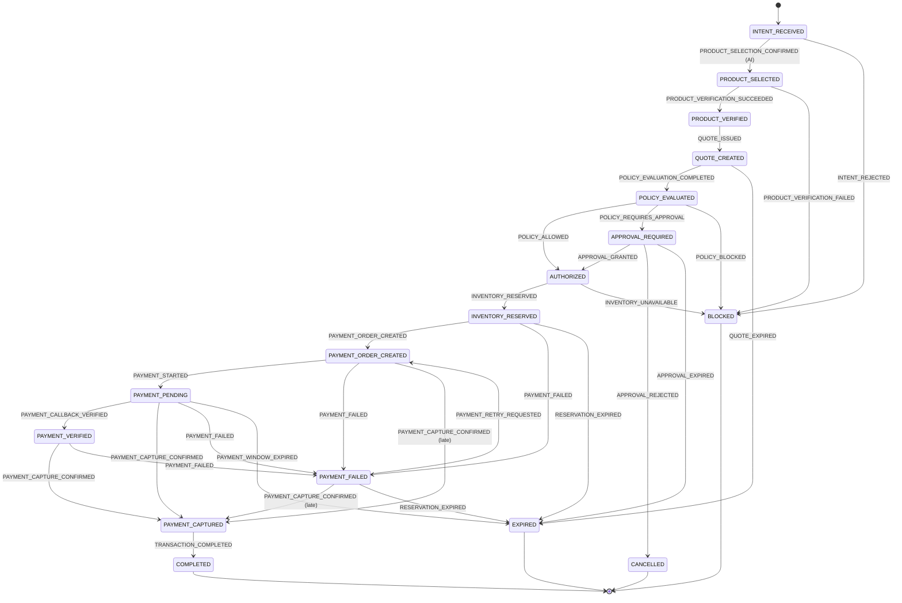

# 17 — The authoritative transaction state machine

**Implemented in Objective 3.** [05](./05-transaction-state-machine.md) holds the
lifecycle _design_; this document describes the working mechanism — the event
model, the service, and the guarantees it makes.

## The permanent invariant

> **NO MODULE MAY DIRECTLY ASSIGN `Transaction.status`.**

The catalog, policy, approval, inventory, payment and webhook services — every
one of them, now and later — must go through:

```
service → domain event → transition service → pure state machine → atomic commit
```

There is deliberately no `setTransactionStatus(id, status)` anywhere in the
codebase, and none may be added. A function that accepts a target state is not a
state machine; it is an assignment with extra steps, and it would let any
service, or any bug, put a transaction into any state.

## Events are not states

A caller says **what happened**, never **where to go**:

```
INTENT_RECEIVED + PRODUCT_SELECTION_CONFIRMED  →  PRODUCT_SELECTED
```

The machine decides whether the event is legal from the current state, and what
state results. 26 events are defined in
[`events.ts`](../src/domain/transaction/events.ts); 17 states in
[`states.ts`](../src/domain/transaction/states.ts). They are separate
vocabularies on purpose.

## Ordering: verify before quoting

```
PRODUCT_SELECTED → PRODUCT_VERIFIED → QUOTE_CREATED
```

Not the reverse. A `PurchaseQuote` freezes the amount every downstream control
will trust, so the server must prove the authoritative product facts _first_.
Quoting before verifying would freeze a price taken from an agent's unverified
claim — precisely the thing the architecture exists to prevent. A test asserts
both that this ordering exists and that the inverse edges do not.

## The transition matrix

One table, [`transitions.ts`](../src/domain/transaction/transitions.ts). Nothing
is scattered into route handlers or services. Each edge declares its target,
the actors permitted to take it, and a structured reason code.



`TRANSACTION_CANCELLED` edges exist from every non-terminal pre-settlement state
and are omitted above for readability.

## The one self-loop

`QUOTE_CREATED --QUOTE_ISSUED--> QUOTE_CREATED` re-issues a quote without
leaving the quoting phase. A quote can lapse or be invalidated, and the honest
response is a _new_ quote rather than an edited one — but the transaction
itself has not progressed, so there is no new state to move to.

It is safe to loop because each pass writes its own history row under the
`QUOTE_REISSUED` reason code, because a partial unique index permits only one
ACTIVE quote per transaction, and because the edge is restricted to
`quote_service`. See [20](./20-trusted-purchase-quote.md).

## Terminal states

`COMPLETED`, `BLOCKED`, `CANCELLED`, `EXPIRED`. Defined once, in
[`states.ts`](../src/domain/transaction/states.ts). They have **no outgoing
edges**. An ordinary command against one raises `TerminalStateViolationError` —
never a silent reopen, never a silent ignore.

The single exception is a recognised duplicate of an already-completed
legitimate operation, which resolves to "already applied". That is not a
transition; it is an acknowledgement that nothing needs to happen.

## `PAYMENT_FAILED` is not terminal

A failed payment is an expected outcome with two — and only two — exits:

| Exit                                                | Actor                 | Why                                                                                                                                           |
| --------------------------------------------------- | --------------------- | --------------------------------------------------------------------------------------------------------------------------------------------- |
| `PAYMENT_RETRY_REQUESTED` → `PAYMENT_ORDER_CREATED` | `transaction_service` | Retry reuses the existing authorization and reservation. It never re-enters the AI path and never re-derives the amount.                      |
| `PAYMENT_CAPTURE_CONFIRMED` → `PAYMENT_CAPTURED`    | `payment_webhook`     | Money may genuinely have moved after a failure was recorded. Restricted to the webhook actor, so only verified provider evidence can take it. |

Objective 3 makes these transitions _possible_. The conditions under which a
service may request them belong to the payment objective. Everything else from
`PAYMENT_FAILED` — completing, restarting the flow, re-quoting — is rejected.

Objective 14 supplies those conditions for the retry edge: the request must come
from an explicit human action, the persisted attempt count must be below
`MAX_PAYMENT_ATTEMPTS`, and the quote, policy, approval binding and stock hold
must all still hold when re-read. See
[27 — Payment retry](./27-payment-retry.md).

## A late capture during a retry

Objective 14 adds one edge, and it exists for one concrete sequence: attempt #1
is reported failed, a person retries, attempt #2 puts the transaction back at
`PAYMENT_ORDER_CREATED` — and only then does a genuine capture for attempt #1
arrive.

| Exit                                             | Actor             | Why                                                                                                                                                                            |
| ------------------------------------------------ | ----------------- | ------------------------------------------------------------------------------------------------------------------------------------------------------------------------------ |
| `PAYMENT_CAPTURE_CONFIRMED` → `PAYMENT_CAPTURED` | `payment_webhook` | Money moved. Without this edge the event has no legal transition, is held for reconciliation, and a real capture goes unaccounted for while the buyer is invited to pay again. |

Restricted to `payment_webhook`, like every other route to `PAYMENT_CAPTURED`:
only the party that holds the money may say it arrived. The browser-callback
actor, `payment_provider`, cannot take it, and does not try — the checkout
service refuses any callback outside `PAYMENT_PENDING`.

## `TransactionStatus` ≠ `PaymentAttemptStatus`

Separate concepts, deliberately not collapsed. One `Transaction` owns many
`PaymentAttempt` rows. A single attempt failing (`PaymentAttemptStatus.FAILED`)
does not mean the transaction can never recover — the transaction moves to
`PAYMENT_FAILED`, from which a new attempt may be created. Objective 3 governs
the transaction lifecycle only and writes no attempt rows.

## The four-way classification

[`resolveTransition`](../src/domain/transaction/state-machine.ts) returns one of:

| Kind                                  | Meaning                                                      |
| ------------------------------------- | ------------------------------------------------------------ |
| `APPLY`                               | A legal edge, taken by a permitted actor.                    |
| `IDEMPOTENT_NO_OP`                    | A provider event this transaction has already accounted for. |
| `INVALID`                             | Illegal: terminal state, no such edge, or a forbidden actor. |
| `LATE_EVENT_RECONCILIATION_CANDIDATE` | An external payment event with no legal edge from here.      |

The fourth exists because payment providers send events at-least-once, out of
order, and sometimes long after a transaction moved on. A capture arriving on a
`CANCELLED` transaction is neither a bug nor a safe no-op: money may really have
moved. Classifying it `INVALID` would discard a real financial event;
classifying it `APPLY` would resurrect an abandoned transaction. It is held,
with no state change and no history row, for a reconciliation objective to
resolve.

The state machine knows nothing about Razorpay. A future adapter translates
provider events into these domain events.

## Two boundaries, and only two

A Transaction row may be touched in exactly two places.

```
createTransaction(command)                  ← creation-service.ts
  → INSERT with status = INTENT_RECEIVED

applyTransactionEvent(command)              ← transition-service.ts
  → resolveTransition(state, event)         ← src/domain/transaction/ (pure)
  → atomic commit                            ← src/integrations/persistence/
```

**Creation is its own boundary because the matrix cannot police it.** There is
no prior state to transition from, so there is no edge to check. That gap is
where a transaction could be born at `AUTHORIZED` — skipping quoting, policy and
approval in a single object literal — so creation is funnelled through one
module that writes `INITIAL_TRANSACTION_STATE` as a constant. The command type
has no `status` field at all, and no `productId`, `authorizedAmount` or
`currency` either: those facts are established later, by the services that
verify them, as part of the transition that establishes them. Their absence is
the control.

**Everything after that is the state machine.** The pure machine has no Prisma,
no network, no clock, no React.

Both boundaries are server-only twice over: each asserts on import via
`assertServerOnly()`, and each depends on the persistence client, which throws
in a browser bundle. Client code cannot open a transaction or move one — the
module fails at evaluation, before any exported function can be reached. No
route handler is exposed yet; Objective 3 builds the internal capability, not an
API surface.

### Enforced, not documented

`eslint.config.mjs` fails the build on any other write:

| Call                                           | Allowed in                   |
| ---------------------------------------------- | ---------------------------- |
| `transaction.create` / `createMany`            | `creation-service.ts` only   |
| `transaction.update` / `updateMany` / `upsert` | `transition-service.ts` only |

`upsert` is grouped with the mutations because it is an update wearing a
create's clothes: it can move a live transaction without ever consulting the
machine. Neither boundary is exempt from the other's rule — the creation service
cannot mutate, and the transition service cannot create, so applying an event to
a transaction that does not exist fails instead of conjuring one.

The exemptions are written as _reduced rule lists_, never `"off"`. A blanket
`"no-restricted-syntax": "off"` would silently drop every other restriction with
it, including the `process.env` boundary. `tests/lint-architecture.test.ts` runs
the real ESLint configuration over fixture source and asserts exactly which
files it lets through, so the rules cannot quietly stop matching.

Tests are exempt on purpose: they must be able to write a raw status to prove a
column persists it, and insert a transaction with a deliberately invalid foreign
key to prove the constraint rejects it. Forbidding that would only push those
proofs out of the suite.

## Atomicity

The status update and the history insert commit in **one** PostgreSQL
transaction. The database is never left with the status changed and history
missing, or the reverse.

Proven by test, not asserted: an over-long idempotency key passes every
application check and then overflows `VARCHAR(128)` on INSERT — _after_ the
status UPDATE has run inside the same transaction. The test then verifies the
status did not advance and no orphan row exists. That is PostgreSQL's rollback
being exercised, not a mock's.

## Concurrency

The write is conditional on the state the decision was made from:

```ts
updateMany({ where: { id, status: from }, data: { status: to } });
```

If another writer moved the transaction first, zero rows match, the whole
database transaction rolls back, and the caller receives
`ConcurrentTransitionConflictError`. There is no read-then-blind-write, and no
distributed lock.

A second, independent guard sits behind it: `sequence` is derived inside the
same transaction and the `unique (transactionId, sequence)` index rejects any
loser that somehow got past the first check.

Tested for real: a verified callback and a failure webhook race from
`PAYMENT_PENDING`. Exactly one commits, the other gets a typed conflict, and
`Transaction.status` still equals the last committed history row.

## Idempotency

`TransitionCommand.idempotencyKey` identifies a _logical operation_, stored on
the transition row and unique per `(transactionId, idempotencyKey)`.

| Situation                                      | Result                                                                                 |
| ---------------------------------------------- | -------------------------------------------------------------------------------------- |
| Same key, same event, replayed                 | `ALREADY_APPLIED` — no second row, no state change                                     |
| Same key, **different** event                  | `DuplicateTransitionConflictError` — a reused identity would misattribute an operation |
| Same event, **fresh** key, state already moved | `ALREADY_APPLIED` — actual state governs                                               |

That last row matters: a caller cannot defeat idempotency by minting a new key.
The state machine evaluates the real current state, so a duplicate capture is
recognised as such regardless of the identity it carries.

Future external events will use their verified provider event id as the
operation identity; internal callers use a server-generated one.

## Transition history

Every applied transition writes exactly one row: transaction id, `sequence`,
`fromStatus`, `toStatus`, `actor`, `trigger` (the event), `reasonCode`, safe
structured `details`, `idempotencyKey`, `createdAt`.

- **Ordering** is by `sequence`, not timestamp — two transitions can share a
  millisecond, and history that cannot be ordered cannot be audited.
- **Reason codes** are a closed vocabulary. Free-form prose is never the
  authoritative reason; a human-readable explanation is derived from a code
  later.
- **Actors** are provider-neutral: `payment_provider`, never `razorpay`.
- **Never stored:** secrets, chain-of-thought, or arbitrary payloads.

Invariant, asserted after every test: `Transaction.status` equals the `toStatus`
of the latest committed transition.

## Errors

| Error                               | When                                              |
| ----------------------------------- | ------------------------------------------------- |
| `TransactionNotFoundError`          | No such transaction                               |
| `InvalidTransitionError`            | No legal edge, or a forbidden actor               |
| `TerminalStateViolationError`       | Ordinary command against a finished transaction   |
| `ConcurrentTransitionConflictError` | Another writer won the race (retryable)           |
| `DuplicateTransitionConflictError`  | An operation key was reused for a different event |
| `TransitionPersistenceFailureError` | The atomic write failed; nothing committed        |

All extend the Objective 1 taxonomy, so each carries an operator-facing message
and a dull public one. Internal state names never reach the browser.

## How future objectives must invoke transitions

```ts
import { applyTransactionEvent } from "@/services/transaction/transition-service";

await applyTransactionEvent({
  transactionId,
  event: "POLICY_ALLOWED",
  actor: "policy_engine",
  idempotencyKey: operationId, // whenever the caller can retry
  details: { ruleApplied: "BUDGET_CEILING" },
});
```

Handle all three outcomes — `APPLIED`, `ALREADY_APPLIED`, `LATE_EVENT_HELD` —
and let the typed errors propagate. Do not catch and continue.

### The outcome may not be discarded

The union stops a caller _misreading_ the answer. It does not stop a caller
throwing it away: `await applyTransactionEvent(...)` as a bare statement
type-checks and silently drops the result, and one of those results —
`LATE_EVENT_HELD` — means **nothing happened**. A caller who ignores it believes
the transaction moved when it did not.

TypeScript has no `#[must_use]`, and there is no typed lint rule for an unused
return value, so this is enforced syntactically: the transition call may not be
the whole of an expression statement.

```ts
await applyTransactionEvent(cmd);        // ✗ rejected — outcome dropped
applyTransactionEvent(cmd);              // ✗ rejected — not even awaited
void applyTransactionEvent(cmd);         // ✗ rejected — deliberate is still dropped

const outcome = await applyTransactionEvent(cmd);   // ✓ assigned
return applyTransactionEvent(cmd);                  // ✓ propagated
return await applyTransactionEvent(cmd);            // ✓ propagated
if ((await applyTransactionEvent(cmd)).kind === "APPLIED") { … }   // ✓ inspected
const { kind } = await applyTransactionEvent(cmd);  // ✓ destructured
record(await applyTransactionEvent(cmd));           // ✓ passed on
```

Both call shapes are covered — a bare import and a method on an injected
service. A caller who genuinely means to discard needs an `eslint-disable`
comment, which is visible in review.

What was deliberately _not_ done: throwing on `LATE_EVENT_HELD` would convert an
expected, non-exceptional outcome into an exception, and collapsing the union
would destroy the distinction the machine exists to draw. The rule forces the
outcome to be _seen_; it does not decide what to do about it.

To open a transaction:

```ts
import { createTransaction } from "@/services/transaction/creation-service";

const { id } = await createTransaction({ buyerProfileId, merchantId, correlationId });
```

A later objective that needs to record a non-lifecycle fact — the authorized
amount, the chosen product — must write it **inside the transition that
establishes it**, by extending `applyTransactionEvent`. It must not reach for a
direct `update`, and it must not widen the lint exemption to get one: that would
re-open the bypass this whole boundary exists to close.

## What Objective 3 did not implement

`LATE_EVENT_HELD` still does nothing but report: no state change, no fabricated
history row, no audit event, no operator surface. Lint now guarantees a caller
must look at it; the reconciliation objective decides what looking at it should
lead to.

No catalog, no buyer agent, no LLM, no quote generation, no policy evaluation,
no approval workflow, no inventory reservation logic, no payment retry rules, no
Razorpay, no webhook endpoint, no audit writing, no HTTP route. The state machine
can _represent_ every one of those steps; none of their business logic exists.
