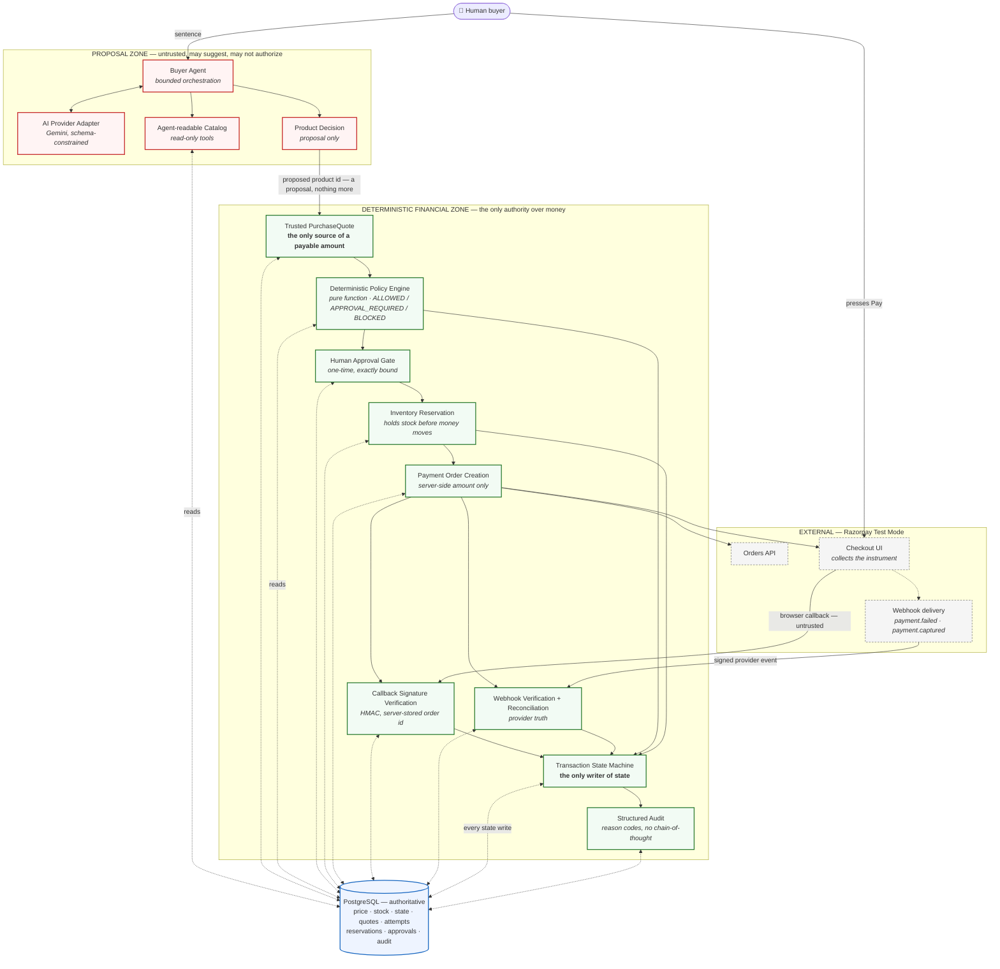
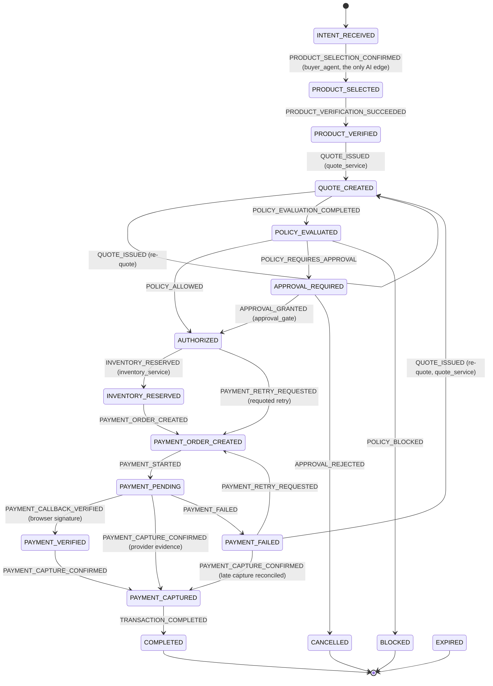
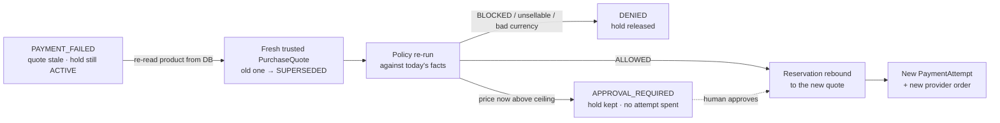

# 28 — Final architecture

The single document a reviewer can read to understand the whole working system.
Everything here describes the repository **as it is**, verified against the
source at the time of writing. Where a claim needs the detail, it links to the
document that owns it.

The one rule the system is built around:

> **The LLM can propose. Deterministic code authorizes. Payment infrastructure
> executes. No LLM output can directly cause a payment.**

---

## 1. What this is

A merchant that an AI buyer agent can transact with end to end, where every
financial action is explainable, bounded, gated and auditable. A person types
_"Find me the best mechanical keyboard under ₹3000 and buy it"_; an agent
completes that purchase without ever being trusted with the money.

It is a **modular monolith**: one Next.js application, one deployable unit, one
PostgreSQL database, with hard internal module boundaries enforced by an ESLint
architecture rule and by tests. It is explicitly not microservices — the boxes in
the diagram below are modules, not services.

**Razorpay runs in Test Mode only.** The configuration boundary refuses any key
id that is not `rzp_test_…`, so a live key pasted into a hosting dashboard fails
closed instead of quietly moving real money.

---

## 2. The architecture



Two things the diagram is drawing deliberately:

- **Orchestration flows left to right; authority does not.** The single arrow
  out of the proposal zone carries a _product id_, never an amount. Everything
  downstream re-reads its own facts from PostgreSQL.
- **PostgreSQL sits under the financial zone, not beside it.** Price, stock,
  transaction state, quotes, attempts, reservations, approvals and audit records
  are all read back from the database at the moment they are used. No component
  trusts a value that arrived over the network.

---

## 3. Trust boundaries

### A. The browser — untrusted

The browser may invoke an operation and may name **which transaction**. It may
not name what anything costs.

| The browser can                      | The browser cannot                                            |
| ------------------------------------ | ------------------------------------------------------------- |
| Send a sentence to the buyer agent   | Choose an authoritative product price                         |
| Ask to start / retry a payment       | Set an amount, currency or quantity on any payment path       |
| Report a Razorpay callback payload   | Set a transaction state                                       |
| Approve or reject a pending approval | Mark a payment captured, verified or complete                 |
| —                                    | Supply the order id used to verify its own callback signature |

Every mutating request body is a `z.strictObject`, so an unexpected field is a
rejection rather than something quietly ignored. The server actions in
`src/app/actions/purchase.ts` accept a sentence and a transaction id, and there
is deliberately nowhere in their signatures to put an amount, a product id, a
policy result or a retry count. Callback verification uses the order id **this
server stored**, never the one the browser returned — see §10.

### B. The LLM — untrusted

Gemini output is treated as a suggestion from an unauthenticated party.

- Both model steps (intent extraction, product selection) are
  **schema-constrained** and re-validated with Zod after the fact; a response
  that does not parse is an audited rejection, not a retry loop.
- Product ids in a selection must appear in the catalog results the tool loop
  actually returned. A model-invented id fails validation.
- The catalog tools are **read-only**. The agent has no tool that creates a
  transaction, issues a quote, evaluates policy, reserves stock, calls Razorpay,
  or writes state — not "is instructed not to", but has none.
- The shopper's stated budget is **locked** into a `const` before the tool loop
  runs, and every candidate is measured against it by code the model cannot
  reach. Nothing later — a second model turn, a tool result, a merchant
  description, a retry — can widen it.
- The tool loop is bounded (`MAX_TOOL_ITERATIONS`), each provider call is
  timed out, and the whole request has an overall budget.
- Only two actors in the state machine are AI-backed (`buyer_agent`,
  `product_decision_engine`), and the only edge either may take is
  `INTENT_RECEIVED → PRODUCT_SELECTED`. Every other transition rejects them.

See [19 — Buyer agent](./19-buyer-agent.md) and
[03 — AI vs deterministic](./03-ai-vs-deterministic.md).

### C. The deterministic financial boundary — trusted

Everything that can move money lives here: the trusted `PurchaseQuote`, the
policy engine, the approval gate, inventory control, server-side order creation,
signature verification, webhook reconciliation, and the state machine. Each is
covered in its own section below.

### D. The database — authoritative

PostgreSQL, via Prisma. Correctness does not rest on the ORM: the invariants
that matter are **database CHECK constraints and unique indexes**, which hold
even against a direct `psql` session and even if application code is wrong.
See §12.

### E. Razorpay — external, Test Mode only

What is ours and what is theirs is enumerated in §14. In short: Razorpay
supplies the Orders API, the Checkout UI, the payment simulation, the callback
payload and the signed webhooks. It supplies none of the policy, approval,
inventory, agent, state-machine, audit or retry authority — all of that is this
application's, and Razorpay could not provide it.

---

## 4. Why the AI cannot control money

The chain, in order, with the authority named at each step:

```
AI proposes  →  server re-reads facts  →  quote freezes the amount
             →  deterministic policy authorizes  →  human approves if required
             →  server reserves stock  →  server creates the provider order
             →  provider webhook reconciles truth  →  state machine advances
             →  audit records why
```

The model cannot do any of the following, and in each case the reason is
structural rather than instructional:

| The LLM cannot…                       | Because                                                                                                                                                                                  |
| ------------------------------------- | ---------------------------------------------------------------------------------------------------------------------------------------------------------------------------------------- |
| Invent the final amount               | The only payable amount is on a server-created `PurchaseQuote` row, built from a fresh database read.                                                                                    |
| Bypass policy                         | `evaluatePolicy` is a pure function of a quote row and a policy row. It has no parameter through which a caller can express a preferred outcome, no network, no clock and no model call. |
| Self-approve                          | Approval requires a token minted server-side, stored only as a SHA-256 digest, and settled by a conditional UPDATE. The agent never receives it.                                         |
| Reserve inventory                     | Reservation is `inventory_service`'s edge in the state machine; AI actors are rejected on it.                                                                                            |
| Start a payment                       | Order creation requires the transaction to already be in a specific state reached by deterministic steps, and reads its amount from the quote. There is no agent tool that calls it.     |
| Declare a payment successful          | Every edge into `PAYMENT_CAPTURED` is restricted to `payment_webhook` or `payment_provider` — verified provider evidence. No AI actor appears on any of them.                            |
| Reset or raise the retry allowance    | Attempts are counted from persisted `PaymentAttempt` rows against a constant, `MAX_PAYMENT_ATTEMPTS = 3`. No request carries a count.                                                    |
| Transition transaction state directly | The API is "this event happened", never "set status to X". The matrix decides whether the event is legal from the current state, and for which actor.                                    |

---

## 5. The authoritative price flow

```
catalog / database facts
   → model proposes a product id (a proposal, nothing more)
   → server re-reads that product from PostgreSQL
   → PurchaseQuote freezes unit × quantity = total, currency, expiry
   → deterministic policy evaluates that frozen total
   → Razorpay order is created for the quote's amount
```

- **Money is integer minor units** (`bigint` paise) everywhere it is stored,
  compared or charged. No float touches an amount, so there is no boundary case
  that depends on rounding. `bigint` never crosses an API boundary raw — it is
  serialised as a string inside a `MoneyDto`.
- **Neither the browser nor the LLM is ever authoritative for the charge.** A
  catalog caller may state a _budget_ — what they are willing to spend — never
  what a product costs.
- **Quote validity and attempt immutability are different clocks.** A quote is
  usable for `QUOTE_TTL_SECONDS` (default 300). Once an order has been created
  for it, the `PaymentAttempt` holding that amount is never edited — a later
  requote creates a _new_ quote and a _new_ attempt rather than rewriting
  either.

---

## 6. PurchaseQuote — the trusted price boundary

A `PurchaseQuote` is the one place a payable amount originates.

| Property                       | How it holds                                                                                                                                                                                |
| ------------------------------ | ------------------------------------------------------------------------------------------------------------------------------------------------------------------------------------------- |
| Trusted inputs only            | Built from a fresh `Product` read inside a database transaction. Nothing from a request body.                                                                                               |
| Immutable financial facts      | `unitAmount`, `totalAmount`, `currency`, `quantity`, `productVersion` are written once and never edited.                                                                                    |
| Arithmetic enforced            | A CHECK constraint requires `totalAmount = unitAmount * quantity`; the policy engine re-derives it independently.                                                                           |
| Bounded life                   | `expiresAt = createdAt + QUOTE_TTL_SECONDS`, with a CHECK that expiry follows creation.                                                                                                     |
| One live price                 | A partial unique index permits at most **one `ACTIVE` quote per transaction**.                                                                                                              |
| Never silently mutated         | Status moves `ACTIVE → SUPERSEDED` (replaced) or `ACTIVE → EXPIRED / INVALIDATED` (lapsed). A superseded quote keeps its original amounts forever, so the financial history stays readable. |
| Requote creates, never revives | A stale quote is superseded and a **new row** is inserted. No code path returns a `SUPERSEDED` quote to `ACTIVE`.                                                                           |

Relationships: a quote belongs to one transaction, is what an
`InventoryReservation` is bound to, is the object the policy engine evaluates,
is what an `ApprovalRequest` is bound to, and is named in the idempotency key of
the `PaymentAttempt` created for it.

Full detail: [20 — Trusted purchase quote](./20-trusted-purchase-quote.md).

---

## 7. Deterministic policy and human approval

### Policy

`evaluatePolicy(quote, policy)` is a pure function returning exactly one of
three decisions. Every path out of it **starts from a refusal**; `ALLOWED` is
produced in one place, at the very end, after every condition has been positively
established — so a check inserted anywhere in the chain fails closed by
construction.

| Decision            | Reason codes                                                                                                                               |
| ------------------- | ------------------------------------------------------------------------------------------------------------------------------------------ |
| `ALLOWED`           | `WITHIN_AUTO_APPROVE_LIMIT`                                                                                                                |
| `APPROVAL_REQUIRED` | `EXCEEDS_AUTO_APPROVE_LIMIT`, `AUTO_PURCHASE_DISABLED`                                                                                     |
| `BLOCKED`           | `NO_POLICY_FOUND`, `POLICY_NOT_ACTIVE`, `POLICY_CURRENCY_MISMATCH`, `UNSUPPORTED_CURRENCY`, `INVALID_QUOTE_AMOUNT`, `INVALID_POLICY_LIMIT` |

Two things worth stating precisely, because they are easy to assume wrongly:

- **There is no amount-based `BLOCKED`.** However large the total, an amount
  above the ceiling escalates to a person — it never refuses outright.
  `BLOCKED` is reserved for policy, currency and data-integrity failures.
- **The ceiling is inclusive.** A limit of 300000 authorizes a total of exactly
  300000; only `amount > limit` escalates. Both operands are `bigint` minor
  units read from PostgreSQL.

Absence is never permission: a buyer with no policy row is `BLOCKED`, not
unlimited.

Full detail: [21 — Policy engine](./21-policy-engine.md).

### Approval

When policy says a person must decide:

- The approval is **exactly bound** — to the transaction, the quote, the exact
  amount and currency, and the policy version in force. A later recheck compares
  all of them; a mismatch on any one means the approval no longer satisfies the
  requirement.
- It **expires**, at the earlier of `APPROVAL_TTL_SECONDS` and the quote's own
  expiry — an approval can never outlive the price it approved.
- The token is a **bearer credential handled as one**: 256 bits from the OS
  CSPRNG, returned exactly once, stored only as a SHA-256 digest in a unique
  `CHAR(64)` column, and compared with `timingSafeEqual`. A dump of the approvals
  table lets nobody approve anything.
- It is **single-use**, enforced by a conditional UPDATE
  (`WHERE status = 'PENDING' AND expiresAt > now`). Two concurrent settlements
  cannot both win; the loser is a replay, audited as
  `approval_replay_rejected`.
- A partial unique index permits at most **one `PENDING` approval per
  transaction**.
- On a retry whose facts changed, a **fresh** approval is required — a stale one
  cannot carry over, because the amount/quote binding no longer matches.

Full detail: [22 — Approval and inventory](./22-approval-and-inventory.md).

---

## 8. Inventory reservation

Stock is held **before** money moves, which is what closes the check-then-charge
race.

- Reserved at `AUTHORIZED → INVENTORY_RESERVED`, by `inventory_service` only.
- Held for `RESERVATION_TTL_SECONDS` (default 600) — deliberately **longer than
  the quote TTL** (default 300), which is why the stale-quote requote path in
  §11 is the ordinary case rather than an exotic one.
- Lifecycle: `ACTIVE → COMMITTED` (paid) or `ACTIVE → RELEASED / EXPIRED`.
- **Oversell is prevented by the database, not by a code comment.** `Product`
  carries `reservedQuantity` under two CHECK constraints:
  `reservedQuantity >= 0` and `reservedQuantity <= inventory`. An over-selling
  UPDATE aborts in PostgreSQL rather than writing an impossible row.
- A partial unique index permits at most **one `ACTIVE` reservation per
  transaction**, so a repeated request converges instead of holding stock twice.
- On a workflow-ending refusal (retry denied on changed facts, product no longer
  sellable) the hold is **released**. On an outcome that is merely waiting for a
  person — a repriced retry that now needs approval — it is deliberately **not**
  released.
- **Commit happens exactly once, after authoritative capture** — never on a
  browser callback. See §10.

---

## 9. The transaction state machine

Seventeen states, one writer. Callers say _"product verification succeeded"_,
never _"set status to PRODUCT_VERIFIED"_; the matrix decides whether that event
is legal from the current state and which actor may raise it. There is no
`setStatus(id, anyStatus)` anywhere.



_Cancellation and expiry edges exist from most non-terminal states and are
omitted above for legibility; the matrix in `src/domain/transaction/transitions.ts`
is authoritative._

**The complete state set:** `INTENT_RECEIVED`, `PRODUCT_SELECTED`,
`PRODUCT_VERIFIED`, `QUOTE_CREATED`, `POLICY_EVALUATED`, `APPROVAL_REQUIRED`,
`AUTHORIZED`, `INVENTORY_RESERVED`, `PAYMENT_ORDER_CREATED`, `PAYMENT_PENDING`,
`PAYMENT_VERIFIED`, `PAYMENT_CAPTURED`, `COMPLETED`, `PAYMENT_FAILED`,
`BLOCKED`, `CANCELLED`, `EXPIRED`.

**Terminal:** `COMPLETED`, `BLOCKED`, `CANCELLED`, `EXPIRED` — no outgoing edges
at all. `PAYMENT_FAILED` is deliberately **not** terminal: a failed attempt is an
expected, recoverable outcome.

**Late and out-of-order provider events are handled, not rejected.** Events whose
authority originates outside the system (`PAYMENT_CALLBACK_VERIFIED`,
`PAYMENT_CAPTURE_CONFIRMED`, `PAYMENT_FAILED`) are classified for reconciliation
rather than treated as nonsense — an illegal _internal_ event is a bug, but an
illegal _external_ one is usually just a late webhook. That is why
`PAYMENT_ORDER_CREATED` and `PAYMENT_FAILED` both accept a capture, reason-coded
`LATE_CAPTURE_RECONCILED`.

Full detail: [17 — Transaction state machine](./17-transaction-state-machine.md).

---

## 10. Payment: order, callback, webhook

### Order creation

- **Server-side only, Test Mode only.** The amount comes from the trusted quote;
  no request body carries one.
- The `PaymentAttempt` row is claimed **before** the provider is called, under a
  unique `idempotencyKey` of the form
  `payment_order:<transactionId>:<quoteId>` (with `:retry<n>` appended for a
  controlled retry). A concurrent duplicate loses the unique-index race and
  **converges on the existing order** rather than creating a second one.
- Further unique indexes make duplication structurally impossible:
  `(transactionId, attemptNumber)`, `(provider, providerOrderId)`,
  `(provider, providerPaymentId)`, and `receipt`.
- Each controlled retry creates a **distinct** `PaymentAttempt` and a
  **distinct** provider order (`RETRY_REUSES_PROVIDER_ORDER = false`).

Full detail: [24 — Payment order creation](./24-payment-order-creation.md).

### Browser callback verification

Razorpay's documented checkout signature:

```
expected = HMAC_SHA256(`${order_id}|${payment_id}`, key_secret)
```

Two rules are load-bearing, and both are the difference between a check and the
appearance of one:

1. **The order id comes from our database**, never from the browser payload. The
   parameter is literally named `serverStoredOrderId` so a call site handing it
   client input reads as wrong. If the client supplied both halves it would be
   signing its own homework.
2. **Comparison is timing-safe.** The digest shape is validated first (64 hex
   characters) so malformed input fails closed rather than throwing.

**What a verified callback proves:** this confirmation is authentic and belongs
to the order this server created. **What it does not prove:** that funds were
captured. That is why `PAYMENT_VERIFIED` is a separate state from
`PAYMENT_CAPTURED`, and why a verified callback alone never commits inventory or
completes a transaction.

A callback may also be **absent entirely** — a closed tab, a dropped
connection — and the payment still captured. The webhook covers that case, which
is precisely why the two are separate facts.

Full detail: [25 — Checkout and verification](./25-checkout-and-verification.md).

### Webhook verification and reconciliation

- The **raw request body** is verified before parsing — HMAC-SHA256 over the
  exact bytes received, using `RAZORPAY_WEBHOOK_SECRET` (a different credential
  from the API key secret: one authenticates us to Razorpay, the other
  authenticates Razorpay to us).
- Handled events: **`payment.failed`** and **`payment.captured`**.
- Every delivery is recorded in a `WebhookEvent` ledger under a unique
  `(provider, externalEventId)` index. A redelivery loses that race, is audited
  as `webhook_duplicate`, and changes nothing.
- Processing is idempotent end to end: a second `captured` delivery does not
  re-capture, does not decrement stock again, and does not complete the
  transaction twice.
- **The webhook is the authoritative capture signal.** Provider truth outranks
  browser truth everywhere the two could disagree.

Full detail: [25 — Checkout and verification](./25-checkout-and-verification.md).

---

## 11. Payment failure and controlled retry

A failed attempt is `PAYMENT_PENDING → PAYMENT_FAILED`, recorded with a
classified failure (category, source, step) so the person is told something
useful.

Retry is **bounded, human-triggered and deterministic**:

- `MAX_PAYMENT_ATTEMPTS = 3`, counted from persisted `PaymentAttempt` rows.
  Nothing in any request carries a count.
- Only an explicit human press starts one. The LLM cannot initiate, reset or
  raise a retry, and no request body can either.
- Each retry is a distinct `PaymentAttempt` with its own provider order.
- A provider's own internal reattempt inside one Checkout session is **not** an
  application retry and does not consume an attempt.

### If the quote is still valid

The ordinary path: `PAYMENT_FAILED → PAYMENT_ORDER_CREATED`, reusing the
existing authorization and hold.

### If the quote is stale but the reservation still lives

Because the reservation TTL is longer than the quote TTL, this is the **common**
case for a real human who pays, fails, reads the error and presses Retry. Rather
than dead-ending the purchase, the system re-quotes:



What is guaranteed on this path:

- Current price, currency, availability and sellability are **re-read from the
  database** — the retry is quoted at today's facts, never yesterday's.
- The old quote stays `SUPERSEDED` **permanently** and is never revived or
  mutated back to `ACTIVE`.
- A changed price that now exceeds the ceiling **requires a fresh human
  approval** before payment can proceed. No attempt is consumed while waiting.
- An unavailable product or unsupported currency **refuses** the retry and
  releases the hold.
- The surviving reservation is **rebound** to the new quote — stock is never
  reserved twice, and `reservedQuantity` does not move.
- The attempt limit still binds. A stale quote does not buy extra attempts.
- Concurrent retry presses cannot produce duplicate quotes, reservations,
  attempts or provider orders — the one-active-quote index settles the race and
  the loser fails closed.

Full detail: [27 — Payment retry](./27-payment-retry.md).

---

## 12. PostgreSQL and Prisma

**PostgreSQL is authoritative.** Prisma is the typed client and migration tool —
it is not where the guarantees live. The invariants below are enforced by the
database itself and hold even against a direct `psql` session:

| Invariant                                      | Mechanism                                                                                                                            |
| ---------------------------------------------- | ------------------------------------------------------------------------------------------------------------------------------------ |
| Stock can never be oversold                    | CHECK `reservedQuantity >= 0`, CHECK `reservedQuantity <= inventory`, CHECK `inventory >= 0`                                         |
| A quote's total always matches its line maths  | CHECK `totalAmount = unitAmount * quantity`                                                                                          |
| Money is never negative                        | CHECK `>= 0` on every amount column                                                                                                  |
| Currency is a real ISO-4217 code               | CHECK `currency ~ '^[A-Z]{3}$'` on every table carrying one                                                                          |
| Expiry always follows creation                 | CHECK `expiresAt > createdAt` on quotes, reservations and approvals                                                                  |
| At most one live price per transaction         | Partial unique index `purchase_quote_one_active_per_transaction`                                                                     |
| At most one live hold per transaction          | Partial unique index `inventory_reservation_one_active_per_transaction`                                                              |
| At most one open approval per transaction      | Partial unique index `approval_request_one_pending_per_transaction`                                                                  |
| No duplicate payment order / attempt / payment | Unique `(transactionId, attemptNumber)`, `(provider, providerOrderId)`, `(provider, providerPaymentId)`, `idempotencyKey`, `receipt` |
| No duplicate webhook processing                | Unique `(provider, externalEventId)`                                                                                                 |
| No duplicate transition or audit row           | Unique `(transactionId, sequence)`, `(transactionId, idempotencyKey)`, `audit_event.operationKey`                                    |

Concurrency is handled with two idioms throughout, both of which fail closed:

- **Conditional UPDATE as a guard** — `WHERE status = 'ACTIVE' AND …`, where a
  row count other than 1 means somebody else already settled it.
- **Unique index as a claim** — insert first, and let a unique violation
  (`P2002`) mean "another caller already owns this", then converge on their row.

Both run inside `prisma.$transaction`, so a partial write is not a state the
system can be left in.

Full detail: [16 — Database](./16-database.md), [08 — Data model](./08-data-model.md).

---

## 13. Idempotency, control by control

| Operation               | What makes it safe to repeat                                                                        |
| ----------------------- | --------------------------------------------------------------------------------------------------- |
| Transaction transition  | Unique `(transactionId, idempotencyKey)`; a replayed event converges instead of double-advancing    |
| Audit insertion         | Unique `operationKey`                                                                               |
| Approval settlement     | Conditional UPDATE on `status = 'PENDING' AND expiresAt > now`                                      |
| Inventory reservation   | Partial unique index on one `ACTIVE` reservation per transaction                                    |
| Reservation requote     | Conditional UPDATE matching transaction, `ACTIVE` status, unexpired, product and quantity           |
| Razorpay order creation | Unique `idempotencyKey` claimed before the provider call; the loser converges on the winner's order |
| PaymentAttempt          | Unique `(transactionId, attemptNumber)` plus the idempotency key above                              |
| Webhook delivery        | Unique `(provider, externalEventId)`; duplicates audited and dropped                                |
| Capture handling        | State machine refuses a second capture; duplicate deliveries are classified, not applied            |
| Inventory commit        | Runs once, inside the capture transaction, guarded by the reservation's `ACTIVE` status             |
| Transaction completion  | Single legal edge `PAYMENT_CAPTURED → COMPLETED`; a repeat is not a legal transition                |
| Retry concurrency       | One-active-quote index plus the attempt idempotency key                                             |

---

## 14. This application vs Razorpay Test Mode

A clear split, because it is the question a reviewer most often needs answered.

| Owned by **this application**                                      | Provided by **Razorpay Test Mode**              |
| ------------------------------------------------------------------ | ----------------------------------------------- |
| AI orchestration and the bounded buyer agent                       | Orders API (create an order for an amount)      |
| Agent-readable catalog and deterministic filtering                 | Checkout UI, and collection of the instrument   |
| Product selection validation against observed catalog facts        | Test-mode payment simulation (success/failure)  |
| Trusted `PurchaseQuote` and the authoritative amount               | The callback payload and its signature          |
| Deterministic policy engine                                        | Signed webhook delivery                         |
| Human approval gate, token minting, binding and replay protection  | The `payment.failed` / `payment.captured` facts |
| Inventory reservation, oversell prevention, commit and release     | —                                               |
| Transaction state machine and every state write                    | —                                               |
| Retry and requote authority, and the attempt limit                 | —                                               |
| Structured audit trail and explainability                          | —                                               |
| Reconciliation logic that decides what a provider event means here | —                                               |

**No card data ever touches this application.** Razorpay's own checkout collects
the instrument in its own frame; there is no card field, no CVV field and
nothing to persist on this side.

---

## 15. Structured audit and explainability

Every meaningful step writes a structured `AuditEvent`: a typed event name from
a closed vocabulary, an actor, a result, a reason code, a correlation id, a
transaction id, and a strict-schema metadata object. Unknown metadata keys are
**rejected**, not silently dropped.

Representative event names that genuinely exist include `intent_interpreted`,
`product_selected`, `quote_created`, `quote_reissued`, `policy_evaluated`,
`approval_requested`, `approval_granted`, `approval_replay_rejected`,
`inventory_reserved`, `inventory_reservation_requoted`, `inventory_committed`,
`inventory_released`, `payment_order_created`, `payment_attempt_started`,
`payment_verified`, `payment_captured`, `payment_failed`,
`payment_retry_requested`, `payment_retry_authorized`, `payment_retry_denied`,
`webhook_received`, `webhook_duplicate`, `webhook_rejected`,
`transaction_completed`.

Two rules the audit trail is built on:

- **No secrets.** No approval token, no API key, no provider payload, no
  database URL.
- **No chain-of-thought.** The model's hidden reasoning is never persisted.
  Explainability comes from deterministic structured facts — which policy
  version, which quote, which amount, which reason code — and the human-readable
  sentence is _derived from the code_ at read time, not stored as prose. A stored
  sentence would be unqueryable, would drift when reworded, and would invite
  someone to write the model's narration into it.

Full detail: [23 — Audit and explainability](./23-audit-and-explainability.md).

### The Agentic Purchase Safety Passport

The transaction page carries a compact panel that answers "why was this
AI-assisted purchase safe?" in a few seconds, so a reviewer does not have to
read the whole trail to see the shape of it. It reports the AI's authority and
the server's, the verified price, the policy decision, whether approval was
required, the stock hold, the callback verification and the provider capture
**separately**, whether inventory was committed, how each payment attempt ended,
and whether a redelivered provider event was deduplicated.

It is derived, never stored, and **no language model writes any part of it** —
the builder is a pure function over persisted rows, with no field a model output
could occupy. A positive claim requires evidence for that specific claim:
"captured" is never inferred from a verified callback, "committed" never from a
capture, and "exactly once" never from a single current row, because a row shows
the present and "once" is a claim about history. Absent evidence renders as
`NOT_REACHED`, drawn neutral rather than green.

It complements the audit timeline and does not replace it: the trail below it
remains the complete chronological evidence.

Full detail: [29 — Safety passport](./29-safety-passport.md).

---

## 16. End-to-end: a successful Test Mode purchase

**Test Mode only. No real money moves at any point.**

```
1.  Buyer types a sentence
2.  Buyer agent extracts a structured intent      (model, schema-constrained)
3.  Budget verified against the buyer's own words (deterministic)
4.  Authority LOCKED                              (deterministic)
5.  Bounded read-only catalog tool loop           (model + tools)
6.  Proposal validated against observed facts     → PRODUCT_SELECTED
7.  Product re-read from PostgreSQL               → PRODUCT_VERIFIED
8.  Trusted PurchaseQuote freezes the amount      → QUOTE_CREATED
9.  Deterministic policy evaluates that total     → POLICY_EVALUATED
10. ALLOWED → AUTHORIZED   (or APPROVAL_REQUIRED → human decides → AUTHORIZED)
11. Stock reserved                                → INVENTORY_RESERVED
12. Buyer presses Pay; server creates the order   → PAYMENT_ORDER_CREATED
13. Razorpay Checkout opens                       → PAYMENT_PENDING
14. Callback signature verified, if delivered     → PAYMENT_VERIFIED
15. Signed payment.captured webhook arrives       → PAYMENT_CAPTURED
16. Inventory COMMITTED, exactly once
17. Transaction                                   → COMPLETED
```

Step 14 is optional; step 15 is authoritative.

---

## 17. End-to-end: failure, then a controlled retry

**A — an ordinary failed payment**

```
PAYMENT_PENDING → payment.failed webhook → PAYMENT_FAILED
   attempt 1 recorded FAILED, with a classified reason
   stock stays held; the buyer is offered a bounded retry
```

**B — the stale-quote controlled retry** (the production-proven path)

```
attempt 1 FAILED
   → the 5-minute quote expires while the person reads the error
   → buyer presses Retry (attempt 2 of 3)
   → old quote SUPERSEDED, fresh trusted quote created from current DB facts
   → policy re-run against the new amount            → AUTHORIZED
   → surviving reservation REBOUND to the new quote  (stock not reserved twice)
   → distinct PaymentAttempt #2, distinct provider order
   → Razorpay Checkout → payment.captured webhook    → PAYMENT_CAPTURED
   → inventory COMMITTED exactly once                → COMPLETED
```

This has been exercised end to end against the deployed environment with real
Razorpay Test Mode, including a genuine bank decline on attempt 1 and a genuine
**duplicate webhook redelivery** after capture. The redelivery was recognised,
audited as `webhook_duplicate`, and changed nothing: one capture, one stock
decrement, one completion.

---

## 18. Verification

Automated verification runs **entirely on this machine** and is enforced to stay
that way: a Vitest setup file blocks non-loopback `fetch` in every worker, so a
test cannot spend Gemini quota, call Razorpay, or reach a hosted database.

| Command                 | Does                                                       |
| ----------------------- | ---------------------------------------------------------- |
| `npm run verify`        | typecheck → lint → test → build                            |
| `npm run format:check`  | Prettier, deliberately separate from `verify`              |
| `npm run db:test:up`    | Start the local Docker PostgreSQL                          |
| `npm run db:test:setup` | Prepare the disposable test schema                         |
| `npm run test`          | Vitest — two projects, `unit` (parallel) and `db` (serial) |

Reaching a real external service is always an explicitly named, deliberately run
script: `gemini:smoke`, `agent:smoke`, `razorpay:smoke`, `checkout:smoke`, and
the `db:*:staging` commands. None of them runs as part of verification.

Full detail: [12 — Testing](./12-testing.md).

---

## 19. Reviewer's index

| Question                                                | Answered in                                                   |
| ------------------------------------------------------- | ------------------------------------------------------------- |
| Where does AI have authority?                           | §3B, §4                                                       |
| Where does it explicitly not?                           | §3B, §4                                                       |
| Where does the authoritative price come from?           | §5, §6                                                        |
| Why can the browser not change the amount?              | §3A, §5                                                       |
| What exactly is a PurchaseQuote?                        | §6                                                            |
| When does human approval happen?                        | §7                                                            |
| How is overselling prevented?                           | §8, §12                                                       |
| What is the transaction state machine?                  | §9                                                            |
| When is a Razorpay order created?                       | §10                                                           |
| What does browser signature verification prove?         | §10                                                           |
| What does a captured webhook prove?                     | §10                                                           |
| Why are PAYMENT_VERIFIED and PAYMENT_CAPTURED separate? | §10                                                           |
| What happens on a failed payment?                       | §11, §17A                                                     |
| What if the quote expires before the retry?             | §11, §17B                                                     |
| How are retries bounded?                                | §11                                                           |
| How are duplicate webhooks handled?                     | §10, §13                                                      |
| How is inventory committed exactly once?                | §8, §13                                                       |
| What is written to the audit trail?                     | §15                                                           |
| Why was this particular purchase safe?                  | §15, [29](./29-safety-passport.md)                            |
| What database is used locally vs deployed?              | §12, [16](./16-database.md), [26](./26-staging-deployment.md) |
| How are migrations and tests run?                       | §18, [16](./16-database.md)                                   |
| Which parts are ours vs Razorpay Test Mode?             | §14                                                           |
